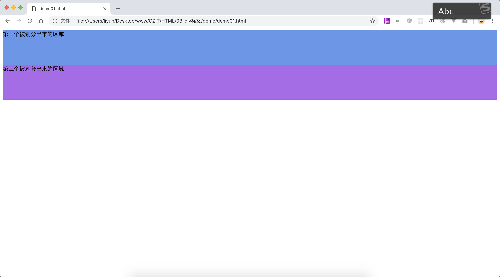

# 用 div 标签给页面划分区域

`<div>`标签用来给页面划分区域(或者说是给页面中的标签进行分组)，通常会和 CSS 配合使用

```html
<style>
    .div1 {
        height: 100px;
        background-color: cornflowerblue;
    }
    .div2 {
        height: 100px;
        background-color: rgb(175, 100, 237);
    }
</style>
<div class="div1">第一个被划分出来的区域</div>
<div class="div2">第二个被划分出来的区域</div>
```

[案例源码](./demo/demo01.html)


