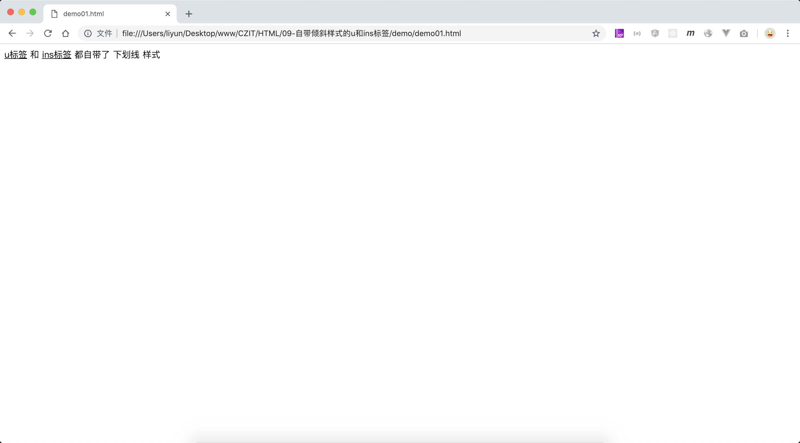

# 自带下划线样式的 u 和 ins 标签

`<u>`、`<ins>`标签自带了下划线样式。

> 字母 u 使用了单词`underline(下划线)`的首字母，字母 ins 使用了单词`insert(插入)`的缩写

```html
<p><u>u标签</u> 和 <ins>ins标签</ins> 都自带了 下划线 样式</p>
```

[案例源码](./demo/demo01.html)


