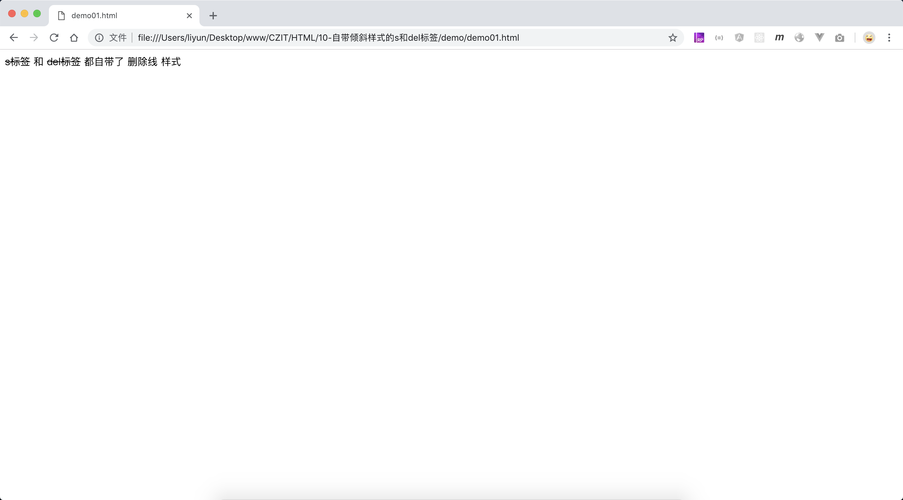

# 自带删除线的 s 和 del 标签

`<s>`、`<del>`标签自带了删除线样式。

> 字母 s 使用了单词`strikethrough(删除线)`的首字母，字母 del 使用了单词`delete(删除)`的缩写

```html
<p><s>s标签</s> 和 <del>del标签</del> 都自带了 删除线 样式</p>
```

[案例源码](./demo/demo01.html)


