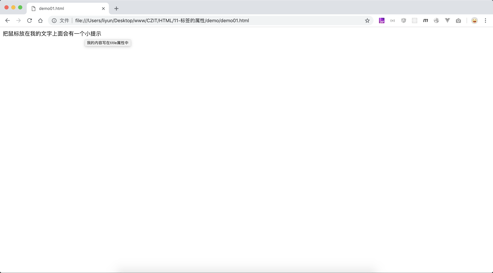

# 标签的属性

标签中可以`属性名=属性值`的格式为标签添加属性，属性值的内容必须用引号包括。标签的属性，分为`全局属性`和`特有属性`两种。

全局属性指得是`所有标签`都可以使用的属性，比如 `title` 属性

## title 属性

`title`属性用来定义元素的额外信息，鼠标放在元素上的时候，该信息会显示出来

```html
<p title="我的内容写在title属性中">把鼠标放在我的文字上面会有一个小提示</p>
```

[案例源码](./demo/demo01.html)



除了 title 之外还有很多全局属性，比如

| 属性名 | 作用                                                  |
| ------ | ----------------------------------------------------- |
| class  | 给元素添加一个类属性，通常与 CSS 配合给元素添加样式   |
| id     | 给元素添加一个 id 属性，通常与 CSS 配合费元素添加样式 |
| style  | 专门用来给元素设置样式                                |

这些属性会在后面的文章中详细介绍。
