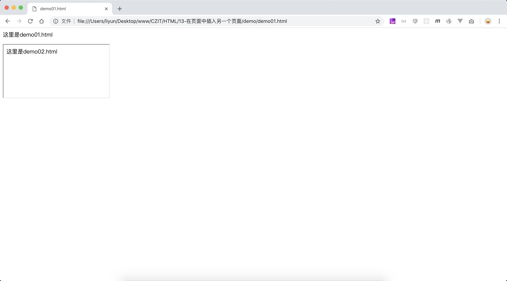

# 使用 iframe 标签插入另一个页面

浏览器允许在页面中插入另一个网页，需要使用`<iframe>`标签,

一个页面中可以插入多个`<iframe>`标签，`<iframe>`标签也可以嵌套使用，也就是说 一个`<iframe>`标签中还可以使用多个`<iframe>`标签。

> 在 HTML5 之前，还有一个`frameset`和`frame`标签，作用同样是用来插入另一个网页，但是在 HTML5 中已经被废弃，不推荐使用。[具体详情可以点击这里](http://www.runoob.com/tags/tag-frame.html)

`demo01.html`

```html
<p>这里是demo01.html</p>
<iframe src="./demo02.html"></iframe>
```

`demo02.html`

```html
<p>这里是demo02.html</p>
```

[案例源码](./demo/demo01.html)



## 属性

`iframe`标签可用的属性列表可以点击[这里](http://www.runoob.com/tags/tag-iframe.html),要注意哪些 HTML5 版本中不再被支持的属性。

`iframe` 元素的四周有一个默认的边框，这个边框可以通过 CSS 去掉
