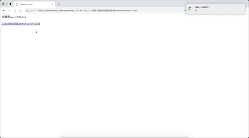

# 使用 a 标签创建超链接

`<a>`标签可以用来让用户在不同的页面之间跳转，被叫做“超链接标签”。

## href 属性

`href`是`<a>`标签的特有属性，用来设置即将跳转的页面地址，页面地址可以是绝对路径，也可以是相对路径，或者是一个网站的地址。

假设有两个网页文件`demo01.html`和`demo02.html`.

`demo01.html`

```html
<p>这里是demo01.html</p>
<a href="./demo02.html">点击我跳转到demo02.html页面</a>
```

`demo02.html`

```html
<p>这里是demo02.html</p>
<a href="./demo01.html">点击我跳转到demo01.html页面</a>
```

[案例源码](./demo/demo01.html)



## target 属性

`target` 属性用来决定打开目标网页的方式，方式有以下几种

-   `_self` ,是默认属性值，表示在本页面打开新的网页
-   `_blank`,表示在新的页面打开
-   `_parent`,当 a 标签是在内嵌页面中，点击超链接会在框架的上一个框架中打开
-   `_top`,当页面中有多个内嵌页面时，点击超链接会在最顶层的那个`iframe`中打开
