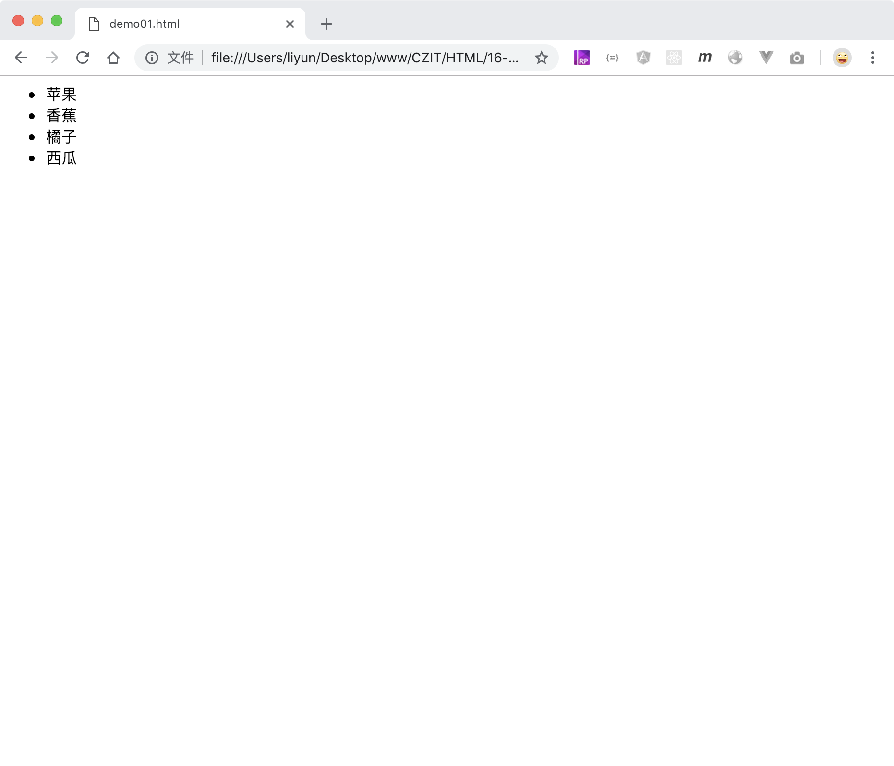
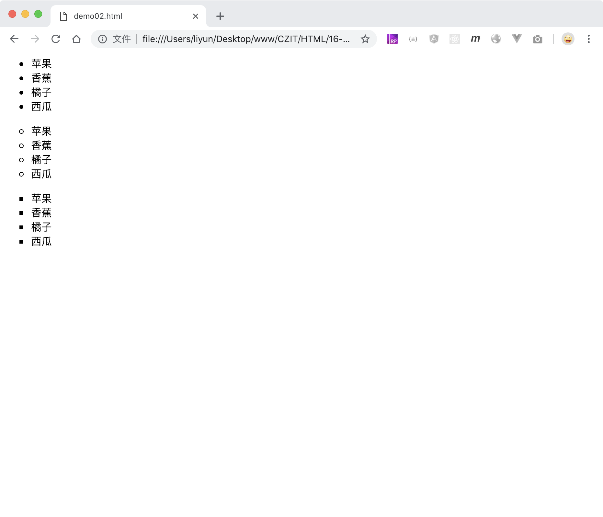

# 用 ul 标签创建无序列表

`<ul>`和`<li>`标签配合使用，可以创建一个无序列表

```html
<ul>
    <li>苹果</li>
    <li>香蕉</li>
    <li>橘子</li>
    <li>西瓜</li>
</ul>
```

[案例源码](./demo/demo01.html)



## type 属性

默认情况下，无序列表的每一个列表项前面自带一个实心小圆点样式，这个样式可以通过标签的 type 属性修改。type 属性可用的属性值如下

| 属性值 | 样式               |
| ------ | ------------------ |
| disc   | 默认值，实心小圆点 |
| circle | 空心小圆点         |
| square | 实心小方块         |

```html
<ul type="disc">
    <li>苹果</li>
    <li>香蕉</li>
    <li>橘子</li>
    <li>西瓜</li>
</ul>
<ul type="circle">
    <li>苹果</li>
    <li>香蕉</li>
    <li>橘子</li>
    <li>西瓜</li>
</ul>
<ul type="square">
    <li>苹果</li>
    <li>香蕉</li>
    <li>橘子</li>
    <li>西瓜</li>
</ul>
```

[案例源码](./demo/demo02.html)



> 无序列表的样式也可以通过 CSS 中的`list-style`属性设置。

> 无序列表还有其他的一些默认样式，可以使用 CSS 重新设置
