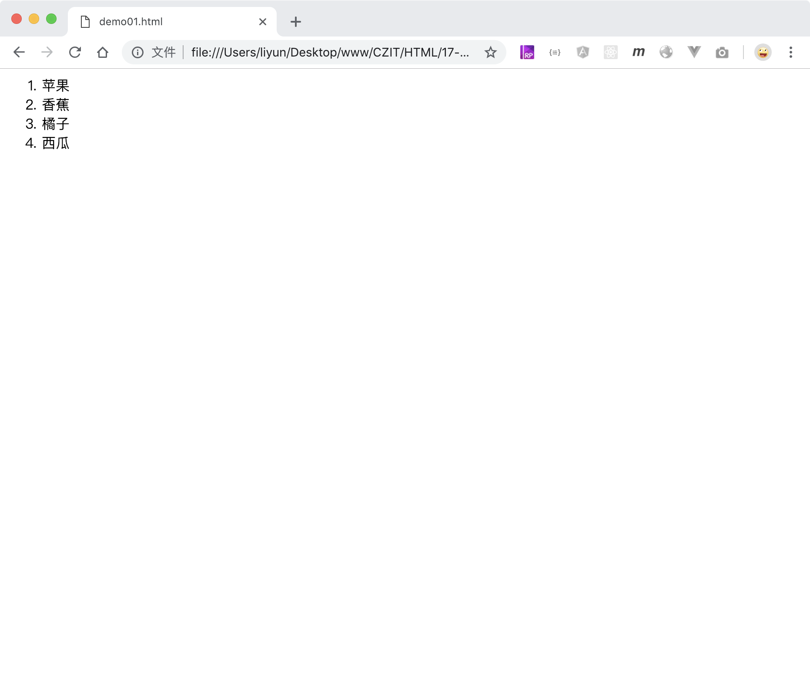
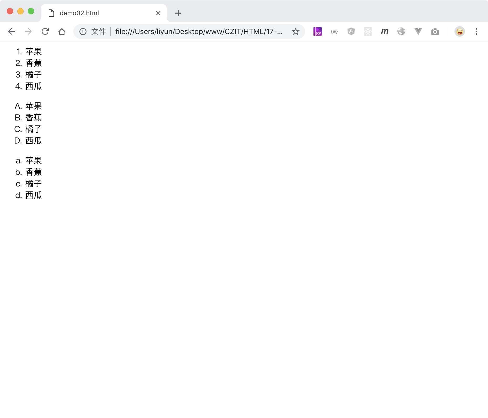

# 用 ol 标签创建有序列表

`<ol>`和`<li>`标签配合使用，可以创建一个无序列表

```html
<ol>
    <li>苹果</li>
    <li>香蕉</li>
    <li>橘子</li>
    <li>西瓜</li>
</ol>
```

[案例源码](./demo/demo01.html)



## type 属性

默认情况下，无序列表的每一个列表项前面自带一个实心小圆点样式，这个样式可以通过标签的 type 属性修改。type 属性可用的属性值如下

| 属性值 | 样式                       |
| ------ | -------------------------- |
| 1      | 默认值，按照阿拉伯数字排序 |
| A      | 按照大写字母排序           |
| a      | 按照小写字母排序           |

```html
<ol type="1">
    <li>苹果</li>
    <li>香蕉</li>
    <li>橘子</li>
    <li>西瓜</li>
</ol>
<ol type="A">
    <li>苹果</li>
    <li>香蕉</li>
    <li>橘子</li>
    <li>西瓜</li>
</ol>
<ol type="a">
    <li>苹果</li>
    <li>香蕉</li>
    <li>橘子</li>
    <li>西瓜</li>
</ol>
```

[案例源码](./demo/demo02.html)



> 有序列表的样式，也可以通过 CSS 中的`list-style`属性重新设置。

> 有序列表还有其他的一些默认样式，可以使用 CSS 重新设置
