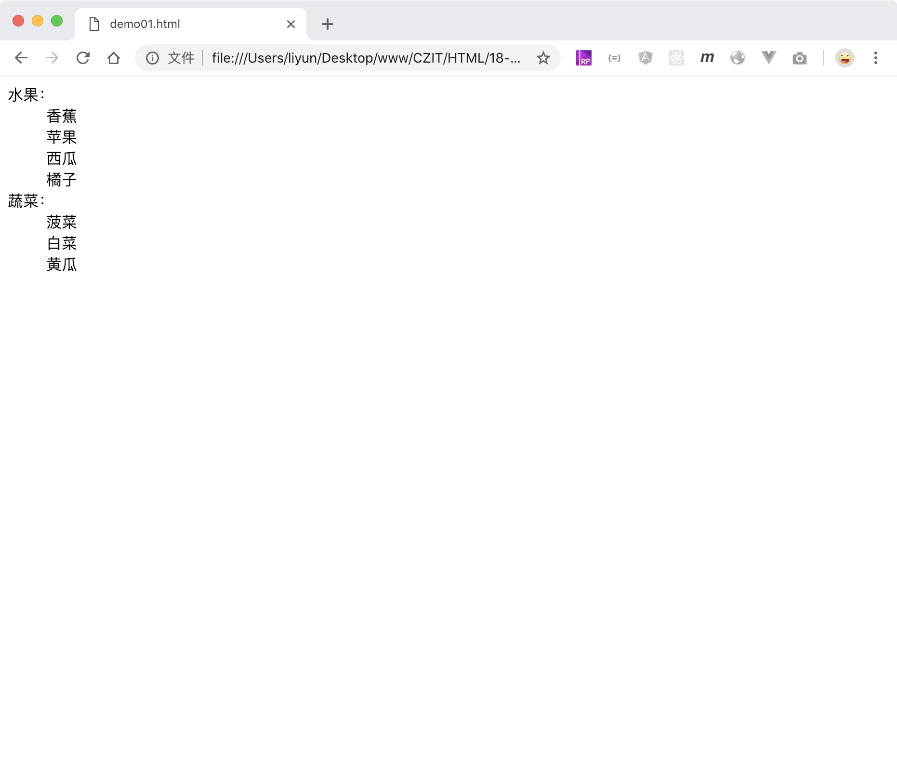

# 用 dl 标签创建有序列表

`<dl>`和`<dt>`、`<dd>`标签配合使用，可以创建一个自定义列表

```html
<dl>
    <dt>水果：</dt>
    <dd>香蕉</dd>
    <dd>苹果</dd>
    <dd>西瓜</dd>
    <dd>橘子</dd>
    <dt>蔬菜：</dt>
    <dd>菠菜</dd>
    <dd>白菜</dd>
    <dd>黄瓜</dd>
</dl>
```

[案例源码](./demo/demo01.html)



在使用自定义列表的时候，要注意`<dt>`和`<dd>`元素之间的样式区别。
