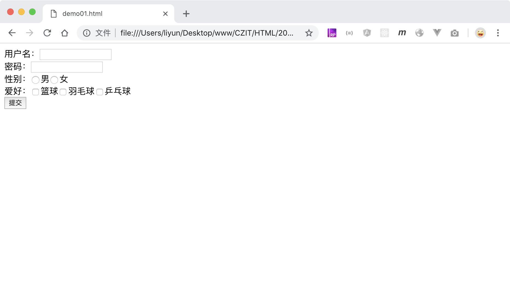

# 用 form 标签插入表单

网页中，表单是很重要的元素，用来给服务器提交信息。在页面中插入表单需要用到`<form>`标签。

表单中一般会提供`文本输入`,`密码输入`,`文件上传`,`单选框`,`多选框`,`下拉框`,`提交表单信息`等功能。下面是一个带了常见功能的表单

[案例源码](./demo/demo01.html)

## <form> 的 action 属性

`action`属性用来设置表单信息的提交地址，通常是一个网址。表单提交后，页面会自动跳转到该地址，并把表单中用户填写的信息传递过去。

## <form> 的 method 属性

`method`属性用来设置表单信息的提交方式，常见的提交方式有两种，一种是`get`，一种是`post`。

-   `get`方式提交的时候，表单信息会明确的显示在浏览器的地址栏中

-   `post`方式提价的时候，可以把表单信息隐藏在后台中，一般人看不到用户填写的信息
