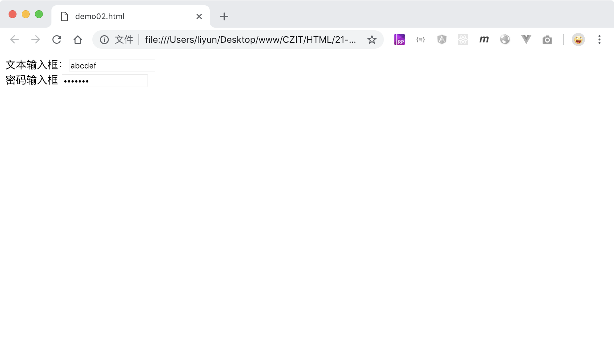
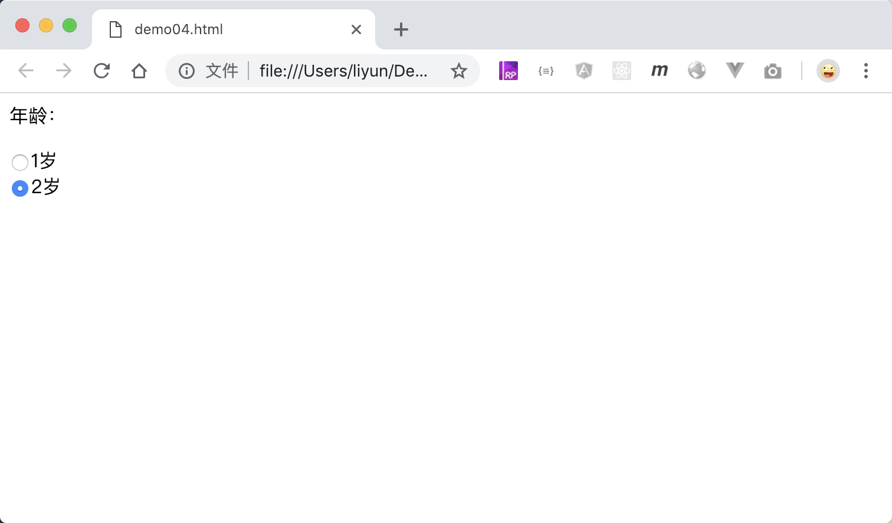
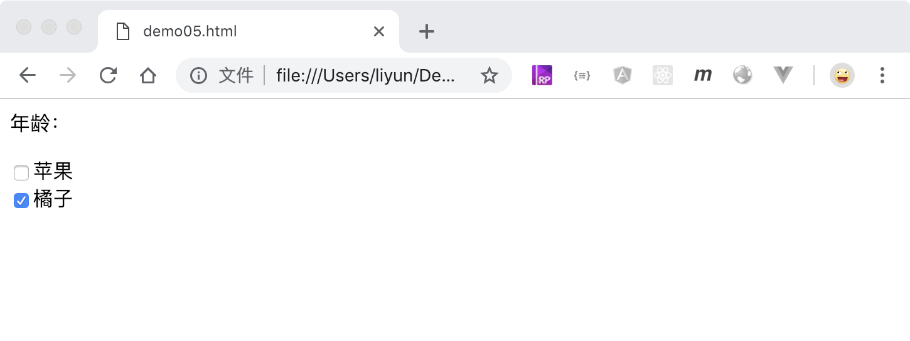
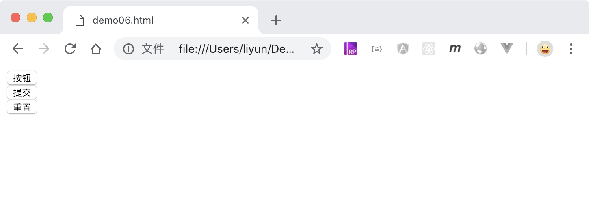
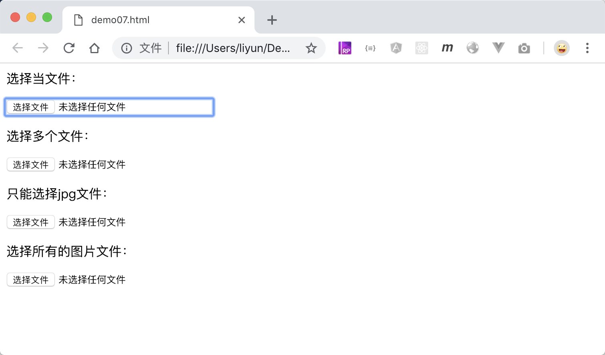

# 用 input 标签插入表单控件

在表单中提供了`文本输入`,`密码输入`,`文件上传`,`单选框`,`多选框`,`下拉框`,`提交表单信息`等功能都有各自对应的标签名。表单中最常见的表单控件用的是`<input>`标签。

> input 是一个自闭和标签，不需要结束标签

## input 标签

input 标签默认情况下是一个文本输入控件，可以在生成的元素中，输入任意文字

```html
<form action=""><input type="text" /></form>
```

## <input>的 type 属性

可以通过设置`input`标签的`type`属性，修改`input`标签的表现方式，常见的`type`属性值如下所示

| 属性值     | 作用                                                   |
| ---------- | ------------------------------------------------------ |
| `text`     | 默认值，文本输入框                                     |
| `password` | 密码输入框，输入的内容不可见                           |
| `radio`    | 单选框，具有相同 name 属性值的单选框只能任选其一       |
| `checkbox` | 复选框，具有相同 name 属性值的复选框可以选择一个或多个 |
| `button`   | 普通的纯按钮                                           |
| `submit`   | 提交按钮，点击后会提交表单                             |
| `reset`    | 重置按钮，点击后会清空用户在表单中的所有输入信息       |
| `file`     | 选择文件按钮                                           |

`<input>`的可用属性有：

| 属性名    | 案例           | 适用 input 类型 | 作用                         |
| --------- | -------------- | --------------- | ---------------------------- |
| name      | `name='pic'`   | 所有类型        | 告诉浏览器表单控件所属的名称 |
| value     | `value='1'`    | text/password   | 设置表单控件的默认值         |
| maxlength | `maxlength=10` | text/password   | 最多允许用户输入 10 个字符   |
| disabled  | `disabled`     | 所有类型        | 禁用当前表单控件(不能修改值) |
| readonly  | `readonly`     | 所有类型        | 限制表单控件只读(不能修改值) |
| checked   | `checked`      | radio/checkbox  | 设置单选框和复选框的默认值   |

## <label>标签

`<label>`标签用来设置表单控件的标题，可以和`表单控件配合使用。当用户点击 label 标签中的文字时，让页面中的光标(焦点)移动到被包括的表单控件中，用法如下：

```html
<form>
    <div><label for="name">姓名：</label> <input type="text" id="name" /></div>
</form>
```

[案例源码](./demo/demo01.html)

> 上面的案例中，必须要保证`label`标签的`for`属性值必须和`input`标签的`id`属性值一致，才能有效

除了上面的案例，`label`标签还有一种更为便捷的用法，不需要添加`for`和`id`属性：

```html
<form>
    <div>
        <label>姓名：<input type="text"/></label>
    </div>
</form>
```

[案例源码](./demo/demo02.html)

## 文本输入框和密码框

```html
<form>
    <div>文本输入框：<input type="text" /></div>
    <div>密码输入框 <input type="password" /></div>
</form>
```

[案例源码](./demo/demo03.html)



> 文本框和密码框，可以通过`value`属性，设置默认值

## 单选框

当`input`标签的`type`属性值为`radio`的时候，元素表现为一个单选框，单选框必须有`name`和`value`属性配合使用。

`name`属性告诉浏览器哪些单选框是一组的，这组单选框中只能任选其一；`value`属性告诉浏览器当前被选中的单选框具体的值是什么。

> 单选框可以通过给`input`标签添加`checked`属性设置默认值，

```html
<form>
    <p>年龄：</p>
    <div>
        <label><input type="radio" value="1" name="sex" />1岁</label>
    </div>
    <div>
        <label><input type="radio" value="2" name="sex" checked />2岁</label>
    </div>
</form>
```

[案例源码](./demo/demo04.html)



## 复选框

当`input`标签的`type`属性值为`checkbox`时，元素表现为一个复选框，复选框也必须有`name`和`value`属性配合使用。

`name`属性告诉浏览器哪些单选框是一组的，这组单选框中只能任选其一；`value`属性告诉浏览器当前被选中的单选框具体的值是什么。

> 复选框也可以通过给`input`标签添加`checked`属性设置默认值。

```html
<form>
    <p>年龄：</p>
    <div>
        <label><input type="checkbox" value="1" name="sex" />苹果</label>
    </div>
    <div>
        <label
            ><input type="checkbox" value="2" name="sex" checked />橘子</label
        >
    </div>
</form>
```

[案例源码](./demo/demo05.html)



## 普通按钮、提交按钮、重置按钮

当`input`的`type`属性值是`button`时，元素在页面中显示为一个纯按钮(纯按钮的意思是，点击之后浏览器不会有任何行为)

当`input`的`type`属性值是`submit`时，元素在页面中显示为一个提交按钮，点击之后，会提交表单中的信息，并跳转到对应页面

当`input`的`type`属性值是`reset`时，元素在页面中显示为一个重置按钮，点击之后，会把表单中用户的所有修改信息，重置到默认值

> `<input>`标签的`value`属性可以设置按钮中显示的文字。

```html
<form>
    <div><input type="button" value="按钮" /></div>
    <div><input type="submit" value="提交" /></div>
    <div><input type="reset" value="重置" /></div>
</form>
```

[案例源码](./demo/demo06.html)



## 文件上传

当`input`的`type`属性值为`file`的时候，元素在页面中显示为一个特殊按钮，按钮点击后，会打开一个对话框，用来选择电脑中的文件。该表单控件需要`name`属性配合，来告诉浏览器当前控件的名称

```html
<input type="file" name="pic1" />
```

默认情况下，一次只能选择一个文件，通过给标签添加`multiple`属性，允许用户同时选择多个文件。

```html
<input type="file" name="pic2" multiple />
```

也可以给标签添加`accept`属性，限制用户上传的文件类型，属性值是文件的 MIME 类型，比如只允许上传 jpg 格式的图片文件，应该写成：

```html
<input type="file" name="pic3" accept="images/jpg" />
```

如果是允许用户上传所有图片类型的文件，可以写成：

```html
<input type="file" name="pic4" accept="images/*" />
```

案例源码](./demo/demo07.html)


