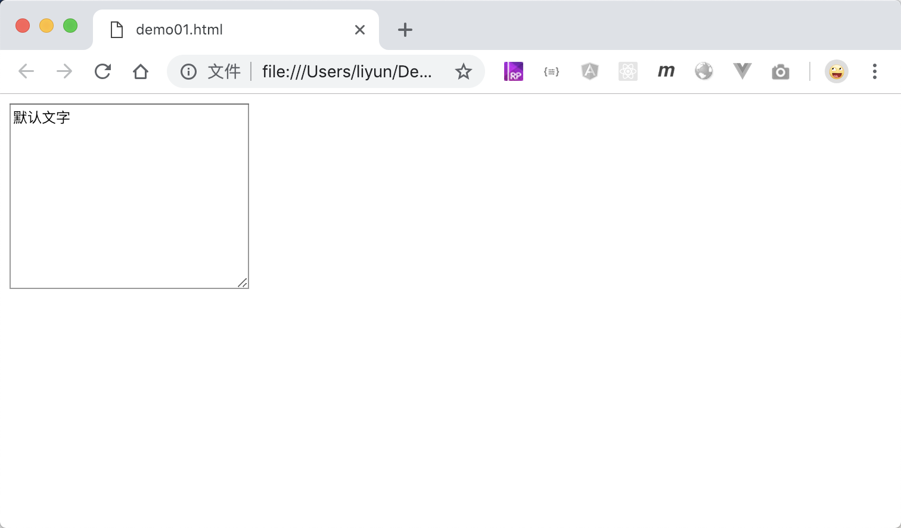

# 用 textarea 标签插入多行文字输入框

前面讲的`input`标签可以生成一个单行文本输入框，HTML 中的`<textarea>`标签则用来生成一个`多行`文本输入框.

> `textarea`标签同样需要 name 属性来告诉浏览器表单控件的名称，标签对之间可以设置默认的文字内容；`cols`和`rows`属性用来设置`textarea`的尺寸。

```html
<form>
    <div><textarea name="tips" cols="30" rows="10">默认文字</textarea></div>
</form>
```

[案例源码](./demo/demo01.html)



> 虽然`cols`和`rows`属性可以设置尺寸，但是强烈推荐使用 CSS 来设置元素的尺寸，而不是使用这两个属性
