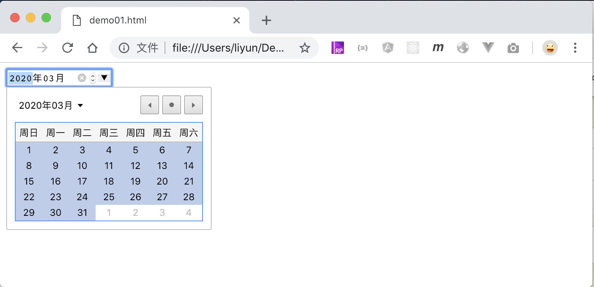
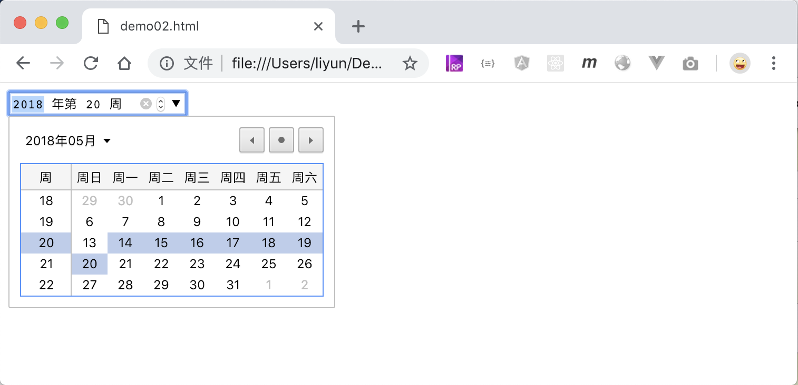
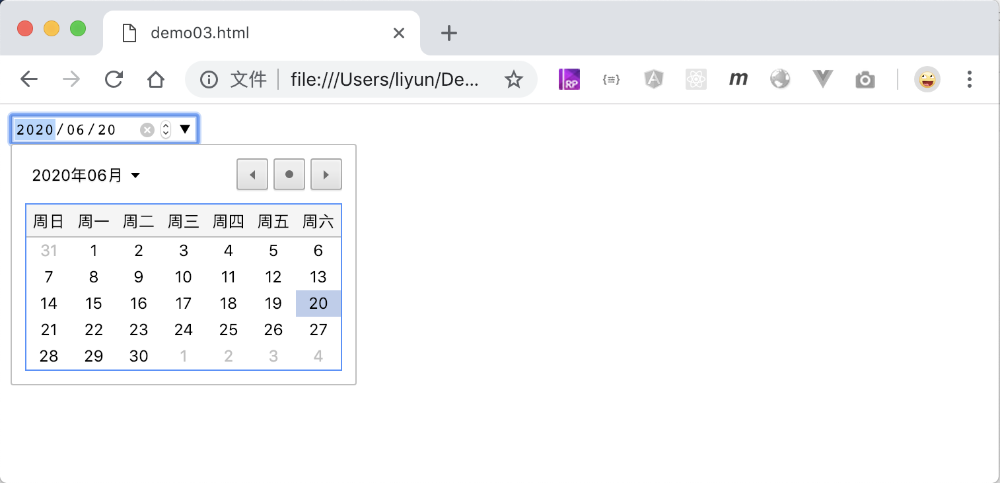
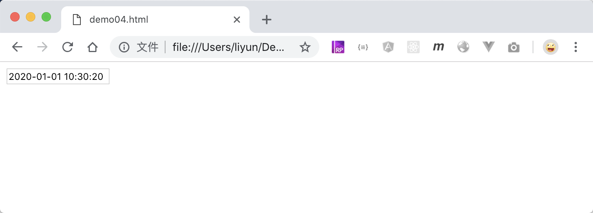
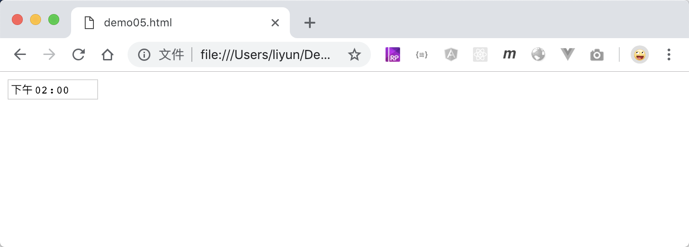
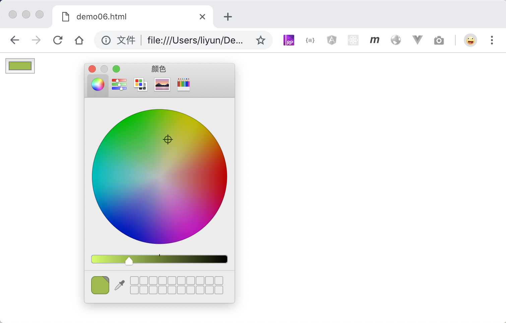
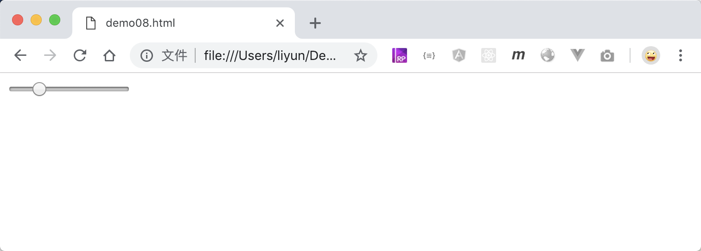
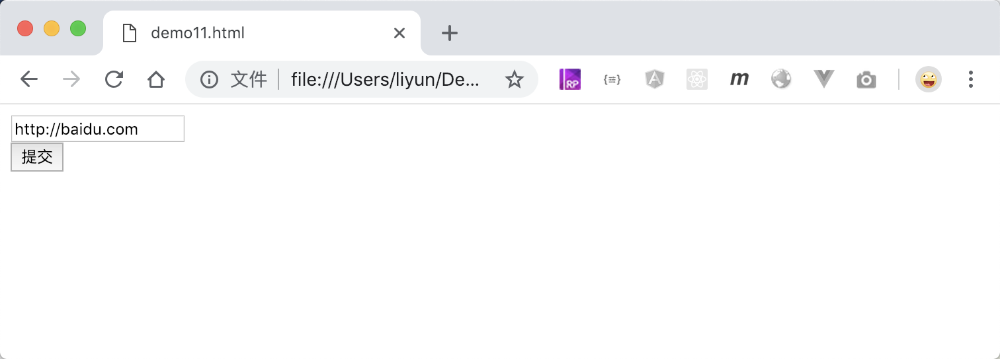

# HTML5 中新增的 input 类型和属性(放到 JS 之后再讲)

HTML5 版本中新增了`input`标签的类型和一些属性。

| type 属性值 | 作用                                         |
| ----------- | -------------------------------------------- |
| `month`     | 年、月选择器                                 |
| `week`      | 年、周选择器                                 |
| `date`      | 年、月、日选择器                             |
| `datetime`  | 年、月、日、时、分、秒输入框                 |
| `time`      | 时间输入框                                   |
| `color`     | 颜色选择器                                   |
| `number`    | 数字输入框                                   |
| `range`     | 数字范围选择器                               |
| `tel`       | 电话输入框                                   |
| `email`     | 邮箱输入框，不符合邮箱规则的提交表单时会提示 |
| `url`       | 网址输入框，不符合网址规则的提交表单时会提示 |

新增的`input`标签的`部分`属性:

| 属性名      | 案例                     | 适用`input`类型      | 作用                                              |
| ----------- | ------------------------ | -------------------- | ------------------------------------------------- |
| autofocus   | `autofocus`              | 所有可以输入型的控件 | 当页面打开的时候，自动把焦点切换到对应的表单控件  |
| placeholder | `placeholder='提示文字'` | 所有可以输入型的控件 | 设置表单控件的提示文字                            |
| required    | `required`               | 所有可输入型控件     | 设置了该属性的控件，如果值为空，表单提交时会提示  |
| max         | `max=20`                 | number/range         | 规定最大值是 20，超出该值表单提交时会提示         |
| min         | `min=10`                 | number/range         | 规定最小值是 20 ，超出该值表单提交时会提示        |
| pattern     | `pattern=正则表达式`     | 所有可以输入型的控件 | 设置一个正则表达式 ，如果不符合，表单提交时会提示 |

[所有的属性点击这里](http://www.runoob.com/tags/tag-input.html)

## month

```html
<form>
    <div><input type="month" name="month" value="2020-03" /></div>
</form>
```

[案例源码](./demo/demo01.html)



## week

```html
<form>
    <div><input type="week" name="week" value="2018-W20" /></div>
</form>
```

[案例源码](./demo/demo02.html)



## date

```html
<form>
    <div><input type="date" name="date" value="2020-06-20" /></div>
</form>
```

[案例源码](./demo/demo03.html)



## datetime

```html
<form>
    <div>
        <input type="datetime" name="datetime" value="2020-01-01 10:30:20" />
    </div>
</form>
```

[案例源码](./demo/demo04.html)



## time

```html
<form>
    <div><input type="time" name="time" value="14:00" /></div>
</form>
```

[案例源码](./demo/demo05.html)



## color

```html
<form>
    <div><input type="color" name="color" value="#96bd3b" /></div>
</form>
```

[案例源码](./demo/demo06.html)



## number

```html
<form>
    <div>
        <input type="number" name="number" value="11" max="20" min="10" />
    </div>
    <button>提交</button>
</form>
```

[案例源码](./demo/demo07.html)


## range

```html
<form>
    <div>
        <input type="range" name="range" max="10" min="1" value="2" step="2" />
    </div>
</form>
```

[案例源码](./demo/demo08.html)



## tel

```html
<form>
    <div><input type="tel" name="tel" value="0377-12345678" /></div>
</form>
```

[案例源码](./demo/demo09.html)


## email

```html
<form>
    <div><input type="email" name="email" value="327743368@qq.com" /></div>
    <button>提交</button>
</form>
```

[案例源码](./demo/demo10.html)


## url

```html
<form>
    <div><input type="url" name="url" value="http://baidu.com" /></div>
    <button>提交</button>
</form>
```

[案例源码](./demo/demo11.html)


