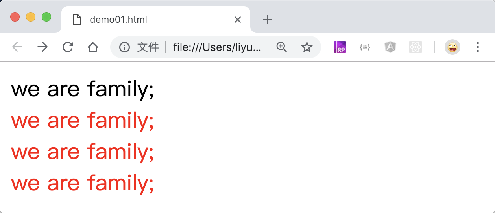
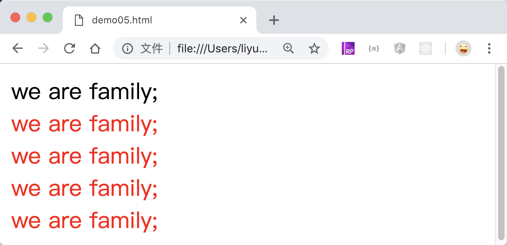

# CSS 属性选择器

属性选择器，可以通过元素是否包含某个属性，或者是某个属性值中是否符合某种规则，来选择对应的元素使用指定的样式。具体格式规则如下

| 选择器            | 作用                                                                |
| ----------------- | ------------------------------------------------------------------- |
| `[name]`          | 选择包含`name`属性的所有元素                                        |
| `[name='value']`  | 选择属性名为`name`且属性值为`value`的元素                           |
| `[name~='value']` | 选择属性名为`name`且属性值包含`value`的元素                         |
| `[name|='value']` | 选择属性名为`name`且属性值等于`value`或者属性值以`value-`开头的元素 |
| `[name^='value']` | 选择属性名为`name`且属性值以`value`或者`value-`开头的元素           |
| `[name$='value']` | 选择属性名为`name`且属性值以`value`或者`-value`结尾的元素           |
| `[name*='value']` | 选择属性名为`name`且属性值中包含`red`字符的元素                     |

下图列出了所有测试过的案例结果，注意选择器使用引号和不使用引号的不同结果！

## `[name]`

案例：选择页面中全部带有 `class` 属性的元素

```html
<style>
    [class] {
        color: red;
    }
</style>
<div>we are family;</div>
<div class="red">we are family;</div>
<div class="red italic">we are family;</div>
<div class="red italic bold">we are family;</div>
```

[案例源码](./demo/demo01.html)



## `[name='value']`

案例：选择所有`class`属性值完全等于`red`的元素

```html
<style>
    [class="red"] {
        color: red;
    }
</style>
<div>we are family;</div>
<div class="red">we are family;</div>
<div class="red italic">we are family;</div>
<div class="red italic bold">we are family;</div>
```

[案例源码](./demo/demo02.html)


## `[name~='value']`

案例：选择所有`class`属性中任意一个值为`red`的元素

```html
<style>
    [class~="red"] {
        color: red;
    }
</style>
<div>we are family;</div>
<div class="red">we are family;</div>
<div class="italic red">we are family;</div>
<div class="italic red  bold">we are family;</div>
```

[案例源码](./demo/demo03.html)


## `[name|='value']`

案例：选择所有`class`属性值**等与**`red`或者以`red-`开头的元素

```html
<style>
    [class|="red"] {
        color: red;
    }
</style>
<div>we are family;</div>
<div class="red">we are family;</div>
<div class="red italic">we are family;</div>
<div class="red italic bold">we are family;</div>
<div class="red-color italic bold">we are family;</div>
```

[案例源码](./demo/demo04.html)


## `[name^='value']`

案例：选择所有`class`属性值以`red`或者`red-`开头的元素

```html
<style>
    [class^="red"] {
        color: red;
    }
</style>
<div>we are family;</div>
<div class="red">we are family;</div>
<div class="red italic">we are family;</div>
<div class="red italic bold">we are family;</div>
<div class="red-color italic bold">we are family;</div>
```

[案例源码](./demo/demo05.html)



## `[name$='value']`

案例：选择所有`class`属性值以`red`或者`-red`结尾的元素

```html
<style>
    [class$="red"] {
        color: red;
    }
</style>
<div>we are family;</div>
<div class="red">we are family;</div>
<div class="italic red">we are family;</div>
<div class="italic red bold">we are family;</div>
<div class="italic bold color-red">we are family;</div>
```

[案例源码](./demo/demo06.html)


## `[name*='value']`

案例：选择所有`class`属性值中包含`red`字符的元素

```html
<style>
    [class*="red"] {
        color: red;
    }
</style>
<div>we are family;</div>
<div class="red">we are family;</div>
<div class="red-color italic">we are family;</div>
<div class="italic red bold">we are family;</div>
<div class="italic bold color-red">we are family;</div>
```

[案例源码](./demo/demo07.html)


