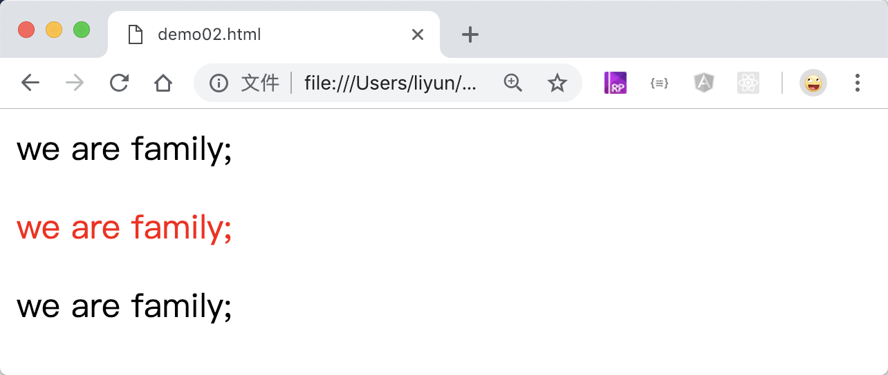

# CSS 组合选择器

CSS 允许同时使用多种方式作为选择器,比如可以把 id 选择器、类名选择器、属性名选择器互相混合。

> 后面要讲的伪类选择器和伪元素选择器通常更需要使用组合选择器来定义元素的样式。

```html
<style>
    /* 同时拥有red和italic两种类名的元素 */
    .red.italic {
        color: red;
    }
</style>
<div class="red">we are family;</div>
<div class="red italic">we are family;</div>
<div class="red italic bold">we are family;</div>
```

[案例源码](./demo/demo01.html)


```html
<style>
    /* p元素，且拥有red和italic两种类名的元素 */
    p.red.italic {
        color: red;
    }
</style>
<p class="red">we are family;</p>
<p class="red italic">we are family;</p>
<div class="red italic bold">we are family;</div>
```

[案例源码](./demo/demo02.html)



```html
<style>
    /* div元素，且id值为red，且类名包含italic 的元素 */
    div#red.italic {
        color: red;
    }
</style>
<p class="red">we are family;</p>
<p class="red italic">we are family;</p>
<div class="red italic bold">we are family;</div>
<div id="red" class="red italic bold">we are family;</div>
```

[案例源码](./demo/demo03.html)


```html
<style>
    /* div元素，且类名包含italic， 且title属性值为name 的元素 */
    div.italic[title="name"] {
        color: red;
    }
</style>
<p class="red italic">we are family;</p>
<div class="red italic bold" title="name">we are family;</div>
<div id="red" class="red italic bold">we are family;</div>
```

[案例源码](./demo/demo04.html)


