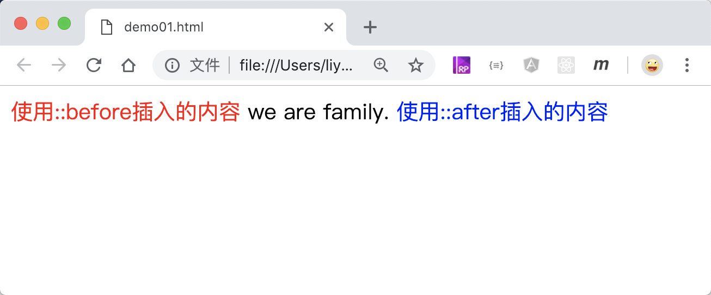

# CSS 伪元素选择器

伪元素选择器是用来选择元素中某一部分的方法，通常使用`组合选择器`的方式来选择元素。

## `::before` 和`::after`

`::before` 和`::after` 分别在元素前面和后面创建一个伪元素，可以配合`content`属性设置元素的内容，生成的元素默认是行内元素。

```html
<style>
    p::before {
        content: "使用::before插入的内容 ";
        color: red;
    }
    p::after {
        content: " 使用::after插入的内容";
        color: blue;
    }
</style>
<p>we are family.</p>
```

[案例源码](./demo/demo01.html)



## `::first-letter`

`::first-letter`会选择指定元素中的第一个字符，并使用大括号中的样式。

```html
<style>
    p::first-letter {
        color: red;
    }
</style>
<p>美猴王为求长生不老，四海求师，在西牛贺洲得到菩提祖师指授，得名孙悟空。</p>
```

[案例源码](./demo/demo02.html)


## `::first-line`

`::first-line`会选择指定元素中的第一行字符，并使用大括号中的样式。

```html
<style>
    p::first-line {
        color: red;
    }
</style>
<p>美猴王为求长生不老，四海求师，在西牛贺洲得到菩提祖师指授，得名孙悟空。</p>
```

[案例源码](./demo/demo03.html)


