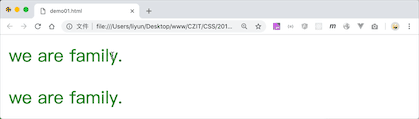
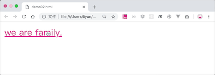
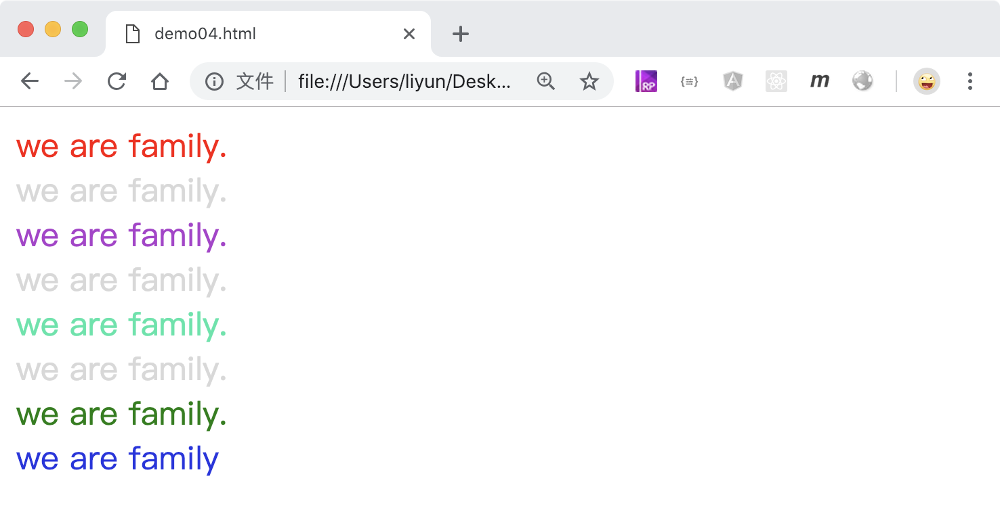
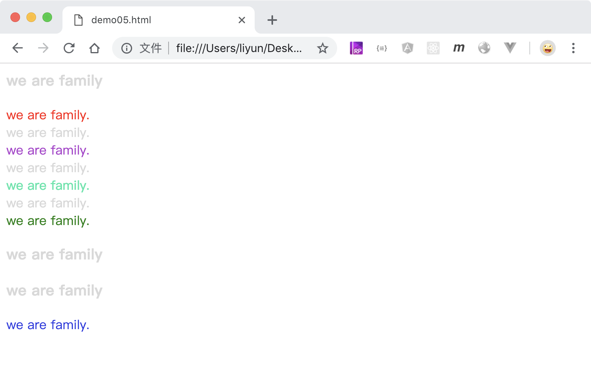

# CSS 伪类选择器

伪类选择器是页面或者当前元素的状态选择元素的一种方式，使用时需要在前面加上冒号`:`，通常会使用`组合选择器`的方式选择元素。

## 所有元素都可以使用的选择器

| 选择器    | 作用                         |
| --------- | ---------------------------- |
| `:acvite` | 定义鼠标按下时的样式         |
| `:hover`  | 定义鼠标移动到元素上时的样式 |

```html
<style>
    p {
        color: green;
    }
    p:active {
        color: red;
    }
    div {
        color: green;
    }
    div:hover {
        color: red;
    }
</style>
<!-- 鼠标点击p元素时，p元素的文字变成红色 -->
<p>we are family.</p>
<!-- 鼠标移动到div元素上时，div元素的文字变成红色 -->
<div>we are family.</div>
```

[案例源码](./demo/demo01.html)



## 超链接上`<a>`标签可以使用的伪类选择器

| 选择器     | 作用                     |
| ---------- | ------------------------ |
| `:link`    | 定义超链接访问之前的样式 |
| `:visited` | 定义超链接访问过后的样式 |

[案例源码](./demo/demo02.html)



## input 标签可以使用的伪类选择器

| 选择器          | 作用                                            |
| --------------- | ----------------------------------------------- |
| `:disabled`     | 定义被禁用状态的 input 样式                     |
| `:enabled`      | 定义未被禁用状态的 input 样式                   |
| `:read-only`    | 定义只读状态的 input 样式                       |
| `:read-write`   | 定义允许读写状态的 input 样式                   |
| `:valid`        | 定义符合控件属性规则的 input 样式               |
| `:invalid`      | 定义不符合控件属性规则的 input 样式             |
| `:checked`      | 定义已被选中状态的单选框或者多选框样式          |
| `:focus`        | 定义当前焦点所在的 input 样式                   |
| `:require`      | 定义当前值在 `min` 和 `max` 之间的 input 样式   |
| `:out-of-range` | 定义当前值不在 `min` 和 `max` 之间的 input 样式 |
| `:required`     | 定义设置了`required`属性的 input 样式           |
| `:optional`     | 定义没有设置`required`属性的 input 样式         |

```html
<style>
    .group1 input:enabled {
        color: green;
    }
    .group1 input:disabled {
        color: red;
    }
    .group2 input:read-only {
        color: green;
    }
    .group2 input:read-write {
        color: red;
    }
    .group3 input:valid {
        color: green;
    }
    .group3 input:invalid {
        color: red;
    }
    .group4 input:checked::before {
        content: "0";
        color: red;
    }
    .group5 input:focus {
        color: limegreen;
    }
    .group6 input:in-range {
        color: green;
    }
    .group6 input:out-of-range {
        color: red;
    }
    .group7 input:optional {
        color: green;
    }
    .group7 input:required {
        color: red;
    }
</style>
<form action="">
    <div class="group1">
        <div>
            <label
                >被禁用的文显示红色，否则显示绿色：<input
                    type="text"
                    value="we are family"
            /></label>
        </div>
        <div>
            <label for=""
                >被禁用的文显示红色，否则显示绿色：<input
                    type="text"
                    value="we are family"
                    disabled
            /></label>
        </div>
    </div>
    <div class="group2">
        <div>
            <label for=""
                >只读的显示为红色，否则显示绿色：<input
                    type="text"
                    value="we are family"
            /></label>
        </div>
        <div>
            <label for=""
                >只读的显示为红色，否则显示绿色：<input
                    type="text"
                    value="we are family"
                    readonly
            /></label>
        </div>
    </div>
    <div class="group3">
        <div>
            <label
                >字符数量>=6且<=8个时显示为绿色，否则显示为红色：<input
                    type="text"
                    maxlength="8"
                    minlength="6"
                    value="1234567"
            /></label>
        </div>
        <div>
            <label
                >字符数量>=6且<=8个时显示为绿色，否则显示为红色：<input
                    type="text"
                    maxlength="8"
                    minlength="6"
                    value="1"
            /></label>
        </div>
    </div>
    <div class="group4">
        <div>
            被选中的input元素前面添加一个红色字符“0”：
            <label><input type="radio" name="sex" value="1" />男</label>
            <label><input type="radio" name="sex" value="2" checked />女</label>
        </div>
        <div>
            被选中的input元素前面添加一个红色字符“0”：
            <label> <input type="checkbox" name="sex" value="1" />篮球 </label>
            <label>
                <input type="checkbox" name="sex" value="1" checked />篮球
            </label>
        </div>
    </div>
    <div class="group5">
        <div>
            <label
                >焦点所在的input元素颜色会变成黄色：<input
                    type="text"
                    value="we are family;"
            /></label>
        </div>
        <div>
            <label
                >焦点所在的input元素颜色会变成黄色：<input
                    type="text"
                    value="we are family;"
            /></label>
        </div>
    </div>

    <div class="group6">
        <div>
            <label
                >当前值在6-8之间时显示为绿色，否则显示为红色：<input
                    type="number"
                    max="8"
                    min="6"
                    value="7"
            /></label>
        </div>
        <div>
            <label
                >当前值在6-8之间时显示为绿色，否则显示为红色：<input
                    type="number"
                    max="8"
                    min="6"
                    value="5"
            /></label>
        </div>
    </div>

    <div class="group7">
        <div>
            <label for=""
                >当前input设置了不能为空时，显示为红色，否则显示为绿色<input
                    type="text"
                    value="we are family"
            /></label>
        </div>
        <div>
            <label for=""
                >当前input设置了不能为空时，显示为红色，否则显示为绿色<input
                    type="text"
                    value="we are family"
                    required
            /></label>
        </div>
    </div>
</form>
```

[案例源码](./demo/demo03.html)


## 在元素的所有兄弟元素中查找符合条件的元素

| 选择器               | 作用                                    |
| -------------------- | --------------------------------------- |
| `:first-child`       | 表示`是所有兄弟元素中第一个元素`，      |
| `:last-child`        | 表示`是所有兄弟元素中最后一个元素`      |
| `:nth-child(n)`      | 表示`是所有兄弟元素中第 n 个元素`       |
| `:nth-last-child(n)` | 表示`是所有兄弟元素中倒数第 n 个元素`   |
| `:only-child`        | 表示`是没有兄弟元素的元素 (独生子元素)` |

```html
<style>
    * {
        color: rgb(216, 216, 216);
    }
    /* 1.是类名包含.group1的后代元素 2.使用了div标签 3.是所有兄弟中的第一个元素 */
    .group1 div:first-child {
        color: red;
    }
    /* 1.是类名包含.group1的后代元素 2.使用了div标签 3.是所有兄弟中的最后一个元素 */
    .group1 div:last-child {
        color: green;
    }
    /* 1.是类名包含.group1的后代元素 2.使用了div标签 3.是所有兄弟中的第3个元素 */
    .group1 div:nth-child(3) {
        color: rgb(176, 56, 206);
    }
    /* 1.是类名包含.group1的后代元素 2.使用了div标签 3.是所有兄弟中的倒数第3个元素 */
    .group1 div:nth-last-child(3) {
        color: rgb(46, 230, 168);
    }
    /* 1.是类名包含.group1的后代元素 2.使用了div标签 3.是独生子元素(没有兄弟姐妹元素) */
    .group2 div:only-child {
        color: rgb(46, 43, 226);
    }
</style>
<div class="group1">
    <div>we are family.</div>
    <div>we are family.</div>
    <div>we are family.</div>
    <div>we are family.</div>
    <div>we are family.</div>
    <div>we are family.</div>
    <div>we are family.</div>
</div>
<div class="group2"><div>we are family.</div></div>
```

[案例源码](./demo/demo04.html)



## 在元素的同类兄弟元素中查找符合条件的元素

| 选择器                 | 作用                                  |
| ---------------------- | ------------------------------------- |
| `:first-of-type`       | 表示`是同类兄弟元素中第一个元素`      |
| `:last-of-type`        | 表示`是同类兄弟元素中最后一个元素`    |
| `:nth-of-type(n)`      | 表示`是同类兄弟元素中第 n 个元素`     |
| `:nth-last-of-type(n)` | 表示`是同类兄弟元素中倒数第 n 个元素` |
| `:only-of-type`        | 表示`没有同类元素的元素`              |

> `同类`表示冒号前面的选择器是相同的。

```html
<style>
    * {
        color: rgb(216, 216, 216);
    }
    /* 1.是类名包含.group1的后代元素 2.使用了div标签 3.是所有同类兄弟中的第一个元素 */
    .group1 div:first-of-type {
        color: red;
    }
    /* 1.是类名包含.group1的后代元素 2.使用了div标签 3.是所有同类兄弟中的倒数第一个元素 */
    .group1 div:last-of-type {
        color: green;
    }
    /* 1.是类名包含.group1的后代元素 2.使用了div标签 3.是所有同类兄弟中的第3个元素 */
    .group1 div:nth-of-type(3) {
        color: rgb(176, 56, 206);
    }
    /* 1.是类名包含.group1的后代元素 2.使用了div标签 3.是所有同类兄弟中的倒数第3个元素 */
    .group1 div:nth-last-of-type(3) {
        color: rgb(46, 230, 168);
    }
    /* 1.是类名包含.group1的后代元素 2.使用了div标签 3.没有同类的兄弟姐妹元素 */
    .group2 div:only-of-type {
        color: rgb(46, 43, 226);
    }
</style>
<div class="group1">
    <h3>we are family</h3>
    <div>we are family.</div>
    <div>we are family.</div>
    <div>we are family.</div>
    <div>we are family.</div>
    <div>we are family.</div>
    <div>we are family.</div>
    <div>we are family.</div>
    <h3>we are family</h3>
</div>
<div class="group2">
    <h3>we are family</h3>
    <div>we are family.</div>
</div>
```

[案例源码](./demo/demo05.html)



## 其他选择器

| 选择器          | 作用                                                |
| --------------- | --------------------------------------------------- |
| `:empty`        | 表示`空元素(没有任何内容的元素)`，比如`<div></div>` |
| `:not(element)` | 表示`除括号内元素以外的元素`                        |
| `:root`         | 表示`根元素`，表示页面的根元素`html`                |
| `:target`       | 表示`当前锚点所在的元素`                            |
| `:lang(en)`     | 表示`设置了使用括号内语言显示属性的元素`            |

```html
<style>
    /* 设置a标签的默认颜色 */
    a {
        color: black;
    }
    /* 锚点所在元素中的a标签改为红色 */
    :target a {
        color: red;
    }
</style>
<div id="d1"><a href="#d1">点击后锚点切换到我的父级元素</a></div>
<div id="d2"><a href="#d2">点击后锚点切换到我的父级元素</a></div>
<div id="d3"><a href="#d3">点击后锚点切换到我的父级元素</a></div>
<div id="d4"><a href="#d4">点击后锚点切换到我的父级元素</a></div>
```

[案例源码](./demo/demo06.html)


