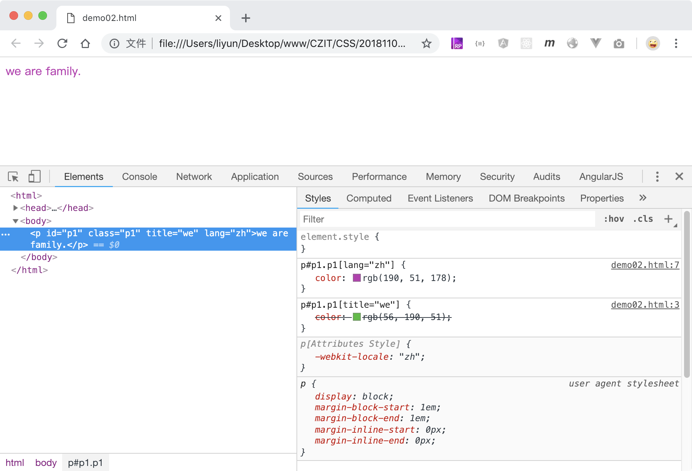

# 样式的优先级

在一个页面中，如果有多个样式设置给了同一个元素，浏览器最终的结果与选择器的优先级有关。而优先级与选择器中的专用性分数有关。

> 选择器的专用性越高，分数越高，优先级越高。

-   `标签选择器`和`伪元素`是最基础的选择器,可能会影响多个元素，因此专用性很低，优先级是最低的，给选择器加`1分`；
-   `类选择器`、`属性选择器`、`伪类选择器`比`标签选择器`专用性更高，优先级高于标签选择器,给选择器加`10分`；
-   `id选择器`很明显比上面四种有更高的专用性(一个元素的 id 值在页面内必须是唯一的)，优先级高于上面四种,可以给选择器加`100分`；
-   `style`属性中的样式专用性更高，只会影响所在的元素，因此它的优先级比上面的六种更高，行内样式没有选择器，它的专用分数是`1000分`。

> 注意：通配符、组合选择器``，`>`，`+`，`~`和`:not()`选择器的专用分为 0.

比如：

| 选择器               | 分数 |
| -------------------- | ---- |
| `p`                  | 1    |
| `p:first-line`       | 2    |
| `p.p1:first-line`    | 12   |
| `p#p1.p1:first-line` | 112  |
| `行内样式`           | 1000 |

```html
<style>
    p {
        color: red;
    }
    p[title="we"] {
        color: green;
    }
    p.p1[title="we"] {
        color: rgb(133, 114, 218);
    }
    p#p1.p1[title="we"] {
        color: rgb(56, 190, 51);
    }
</style>

<p id="p1" class="p1" title="we">we are family.</p>
```

[案例源码](./demo/demo01.html)


如果专用分相同，按照下面顺序，最后定义的规则会生效：

-   继承自父级的样式
-   浏览器内置样式(开发者工具`styles`面板中后面标示`user agent stylesheet`的样式)
-   外联样式(使用`<link>`标签引入的样式)
-   页面样式(写在`<style>`标签内)
-   行内样式(写在元素开始标签的`style`属性内)

```html
<style>
    /* 专用性分数为1+100+10+10=121 */
    p#p1.p1[title="we"] {
        color: rgb(56, 190, 51);
    }
    /* 专用性分数为1+100+10+10=121 */
    p#p1.p1[lang="zh"] {
        color: rgb(190, 51, 178);
    }
</style>

<p id="p1" class="p1" title="we" lang="zh">we are family.</p>
```

[案例源码](./demo/demo02.html)



## 样式的继承

CSS 样式中有一部分是可以被继承的，也就是说，子元素的某个样式会继承父元素的属性，比如`color`

```html
<style>
    div {
        color: red;
    }
</style>
<div><p>we are family</p></div>
```

[案例源码](./demo/demo03.html)


## 浏览器内置样式

浏览器为很多标签都设置了默认样式，比如`Hx,a,p`等等。浏览器内置样式优先级会大于继承自父级的样式，比如

```html
<style>
    div {
        color: red;
    }
</style>
<div><a href="#">we are family</a></div>
```

[案例源码](./demo/demo04.html)


## 指定元素继承父级样式

所有 CSS 属性都可以指定属性为值`inherit`，让元素自动继承父级的属性值。

所以可以通过给 `<a>` 标签的 `color` 样式设置一个特殊值`inherit`，让 a 标签自动继承父级的样式：

```html
<style>
    a {
        color: inherit;
    }
    div {
        color: red;
    }
</style>
<div>we are<a href="#"> family</a></div>
```

[案例源码](./demo/demo05.html)


