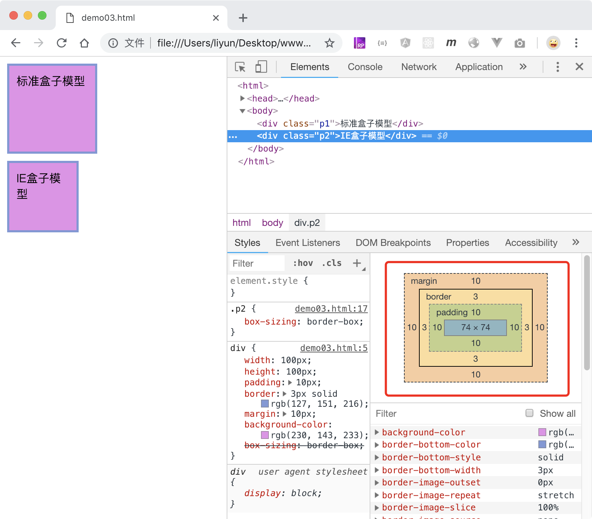

# 改变元素的盒子模型

前面几章说过，一个元素的盒子属性有`width height margin border padding`六种。它们各自的位置是下面这样子的：


用一个案例来看一下浏览器渲染出来的盒子模型：

```html
<style>
    body {
        margin: 0;
    }
    div {
        width: 100px;
        height: 100px;
        padding: 10px;
        border: 3px solid rgb(127, 151, 216);
        margin: 10px;
        background-color: rgb(230, 143, 233);
    }
</style>
<div></div>
```

[案例源码](./demo/demo02.html)


在开发者工具的`computed`面板中观察元素在浏览器中的盒子模型：

-   元素内容的宽高依然是`100*100`;
-   `padding、border、margin` 的尺寸从内向外依次向外扩展，增加元素总尺寸
-   元素总宽度=`width+padding+border+margin`
-   元素总高度=`height+padding+border+margin`
-   元素内容宽度 = `width`
-   元素内容高度 = `height`

## IE 盒子模型

上面讲的是现代浏览器中标准的盒子模型。在早期的 IE 浏览器中可不是这样子的。可以通过`box-sizing`属性让浏览器使用 IE 中的盒子模型。

| 属性值       | 作用                 |
| ------------ | -------------------- |
| contente-box | 默认值，使用标准模型 |
| border-box   | 使用 IE 模型         |

```html
<style>
    body {
        margin: 0;
    }
    div {
        width: 100px;
        height: 100px;
        padding: 10px;
        border: 3px solid rgb(127, 151, 216);
        margin: 10px;
        background-color: rgb(230, 143, 233);
        box-sizing: border-box;
    }
    .p1 {
        box-sizing: content-box;
    }
    .p2 {
        box-sizing: border-box;
    }
</style>
<div class="p1">标准盒子模型</div>
<div class="p2">IE盒子模型</div>
```

[案例源码](./demo/demo03.html)



案例中，分别用了两种盒子模型，上面的是标准盒子模型，下面的是 IE 盒子模型。注意这里案例的红框部分内容和上一个案例红框内容的区别：

-   `border padding`占据了`width height`的空间，把内容部分的空间挤小了。
-   `margin`的位置没有发生变化，依然在`width height`之外
-   元素总宽度 = `width+margin`
-   元素总高度 = `height+margin`
-   元素内容宽度 = `width-border-padding`
-   元素内容高度 = `height-border-padding`

> 盒子模型在 CSS 中是至关重要的一环，许多 UI 框架都把元素的显示方式设置为 IE 模型，在页面布局中，IE 模型比标准模型效率更高。
