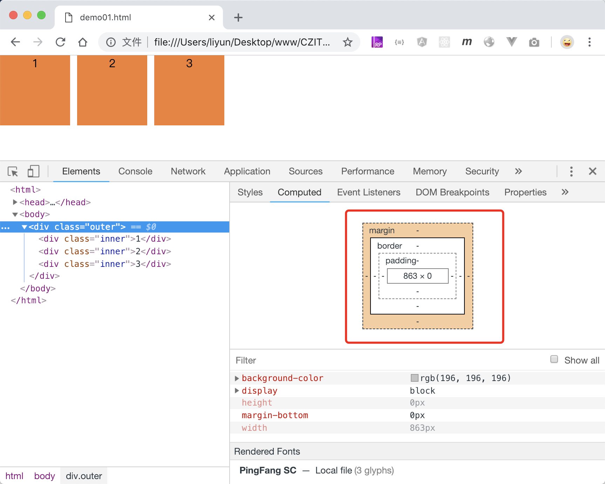
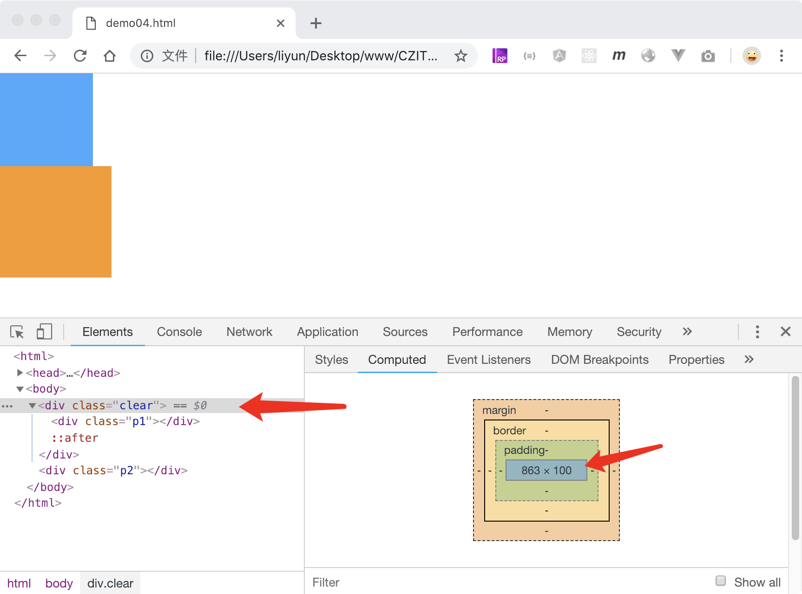

# 浮动布局

前面讲过，一个页面就是由不同的 div 盒子堆叠出来的，这种堆叠，有可能是上下排列，也有可能是左右排列。

上下排列不需要特殊处理，块级元素会自动换行显示,根据块级元素自动换行显示的特点，用来处理上下排列布局；根据行内和行内块元素默认在同一行自左向右显示的特点，用来处理左右排列布局。

这种根据浏览器的默认规则自上而下，自左而右默认排列的方式，被称为`标准文档流`；在标准文档流中，每个元素都在页面中占有一席之地。

今天要说的是通过`float`属性，让元素脱离文档流，来实现左右排列的布局。

| 属性值  | 作用                                     |
| ------- | ---------------------------------------- |
| none    | 默认值，不使用浮动                       |
| left    | 靠左依次浮动（经典案例盒子多行连续显示） |
| right   | 靠右依次浮动                             |
| inherit | 继承父级的浮动样式                       |

```html
<style>
    body {
        margin: 0;
    }
    .outer {
        background-color: rgb(196, 196, 196);
        /* margin-bottom: 10px; */
    }
    .inner {
        width: 100px;
        height: 100px;
        background-color: rgb(243, 128, 51);
        text-align: center;
        float: left;
        margin-right: 10px;
    }
</style>
<div class="outer">
    <div class="inner">1</div>
    <div class="inner">2</div>
    <div class="inner">3</div>
</div>
```

[案例源码](./demo/demo01.html)



## 浮动的缺点

注意看上面效果图中的红框部分。前面说过，元素的高度没有设置的时候默认是 0px，会被元素的内容撑开。在上个案例中，`.inner`元素设置了左浮动属性之后，父级`.outer`元素的高度最终是 0px，也就是说它没有被里面的三个`.inner`元素撑开高度了。这也从侧面说明了`.inner`元素使用了浮动布局后，脱离了文档流，不占用页面空间之后，再也不能撑开父级高度了。

不仅如此，使用了浮动属性的元素还会影响下一个没有使用浮动的兄弟元素，浮动元素的位置会被下一个没有使用浮动的兄弟元素占据。

```html
<style>
    body {
        margin: 0;
    }
    .p1 {
        width: 100px;
        height: 100px;
        background-color: rgb(70, 168, 255);
        float: left;
    }
    .p2 {
        width: 120px;
        height: 120px;
        background-color: rgb(250, 155, 31);
    }
</style>
<div class="p1"></div>
<div class="p2"></div>
```

[案例源码](./demo/demo02.html)


从效果图中可以明显的看出：`.p2`元素占据了`.p1`的位置，还被`.p1`遮挡了一部分。这应该怎么处理呢？CSS 提供了一个属性，专门用来清除`浮动`所带来的影响。

## 清除浮动影响

CSS 中的`clear`属性专门用来清除元素浮动对标准文档流中元素的影响

| 属性值 | 作用                                               |
| ------ | -------------------------------------------------- |
| none   | 不处理浮动影响                                     |
| left   | 清除前面元素左浮动带来的影响                       |
| right  | 清除前面元素右浮动带来的影响                       |
| both   | 清除前面元素浮动带来的影响，不管是左浮动还是右浮动 |

元素被浮动元素遮挡时，可以通过给不想被浮动影响的元素添加`clear`属性解决。

> 注意：使用`clear`属性的元素必须是块级元素

```html
<style>
    body {
        margin: 0;
    }
    .p1 {
        width: 100px;
        height: 100px;
        background-color: rgb(70, 168, 255);
        float: left;
    }
    .p2 {
        width: 120px;
        height: 120px;
        background-color: rgb(250, 155, 31);
        clear: both;
    }
</style>
<div class="p1"></div>
<div class="p2"></div>
```

[案例源码](./demo/demo03.html)


这种原理，就好比是女儿已经出嫁了，父亲说“即便你脱离咱们家嫁出去了，但我们永远都会给你留一个房间”一样，浮动元素后面的元素会把浮动元素的位置空出来，继续按照标准文档流依次插入页面。

## 通用解决办法

通常情况下，还有另一种解决办法：给浮动元素添加一个父级元素，通过`::after`伪元素，在父级元素的最后插入一个空元素，再使用`clear`属性：

```html
<style>
    body {
        margin: 0;
    }
    .p1 {
        width: 100px;
        height: 100px;
        background-color: rgb(70, 168, 255);
        float: left;
    }
    .p2 {
        width: 120px;
        height: 120px;
        background-color: rgb(250, 155, 31);
    }
    .clear::after {
        content: "";
        display: block;
        clear: both;
    }
</style>
<div class="clear"><div class="p1"></div></div>
<div class="p2"></div>
```

[案例源码](./demo/demo04.html)



从效果图中可以看出，

-   `.p1`元素和上面的案例效果一样，不会遮挡住`.p2`元素
-   `.p1`元素的父级：`.clear`元素的高度和标准文档流一样被`.p1`元素撑开了。

前面说使用了`clear`属性的元素会把浮动元素的位置空出来，依次按照标准文档流的形式插入页面，所以父级元素在计算高度的时候，依然添加了浮动元素所占的高度。

元素被浮动之后，如果它的宽度即将超出父级元素宽度，则会换行继续显示：

```html
<style>
    body {
        margin: 0;
    }
    .outer {
        width: 320px;
        background-color: rgb(70, 168, 255);
    }
    .outer::after {
        content: "";
        clear: both;
        display: block;
    }
    .inner {
        width: 120px;
        height: 120px;
        background-color: rgb(250, 155, 31);
        float: left;
    }
    .p2 {
        background-color: rgb(8, 231, 157);
    }
    .p3 {
        background-color: rgb(118, 97, 233);
    }
</style>
<div class="outer">
    <div class="inner p1">p1</div>
    <div class="inner p2">p2</div>
    <div class="inner p3">p3</div>
</div>
```

[案例源码](./demo/demo05.html)


