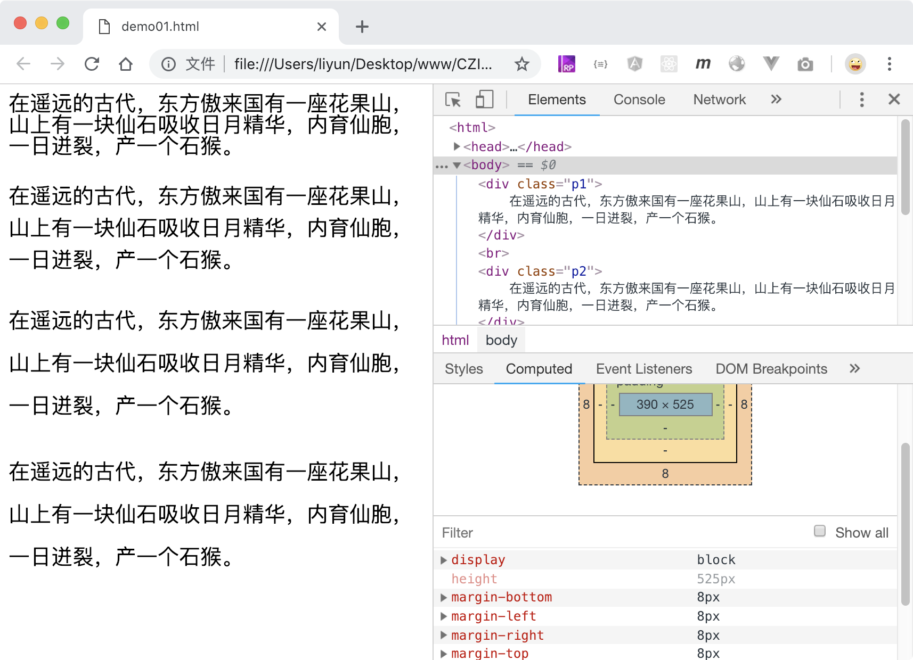

# 设置文字的行高

`line-height`属性用来设置文字的行高(行间距)。

| 属性值   | 作用                                     |
| -------- | ---------------------------------------- |
| `normal` | 默认值。设置合理的行高，由浏览器来决定。 |
| number   | 此数字会与当前的字体尺寸相乘来设置行高。 |
| length   | 使用`px em rem`等长度单位设置行高        |
| %        | 基于当前字体尺寸的百分比设置行高。       |

```html
<style>
    html {
        font-size: 16px;
    }
    div {
        font-size: 20px;
    }
    .p1 {
        line-height: 100%; /* 最终行高是20px */
    }
    .p2 {
        line-height: 1.5; /* 最终行高是30px */
    }
    .p3 {
        line-height: 2em; /* 最终行高是40px */
    }
    .p4 {
        line-height: 2.5rem; /* 最终行高也是40px，因为rem是根据html标签的字体尺寸16px来设置的 */
    }
</style>

<div class="p1">
    在遥远的古代，东方傲来国有一座花果山，山上有一块仙石吸收日月精华，内育仙胞，一日迸裂，产一个石猴。
</div>
<br />
<div class="p2">
    在遥远的古代，东方傲来国有一座花果山，山上有一块仙石吸收日月精华，内育仙胞，一日迸裂，产一个石猴。
</div>
<br />
<div class="p3">
    在遥远的古代，东方傲来国有一座花果山，山上有一块仙石吸收日月精华，内育仙胞，一日迸裂，产一个石猴。
</div>
<br />
<div class="p4">
    在遥远的古代，东方傲来国有一座花果山，山上有一块仙石吸收日月精华，内育仙胞，一日迸裂，产一个石猴。
</div>
```

[案例源码](./demo/demo01.html)


