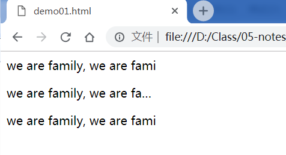
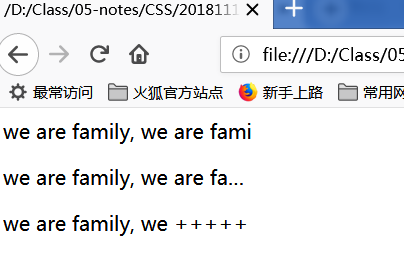

# 设置文字超出部分的替换方式

`text-overflow`属性用来设置，当文字超出元素宽度时的处理方式

| 属性值   | 作用                                                                  |
| -------- | --------------------------------------------------------------------- |
| clip     | 默认值，剪裁掉超出的文字部分。                                        |
| ellipsis | 显示省略符号来代表被修剪的文本。                                      |
| string   | 使用给定的字符串来代替被修剪的文本,目前火狐浏览器已经实现了这个功能； |

注意：

-   文字超出元素宽度后，默认会换行显示，所以必须有`white-space: nowrap`配合使用
-   必须有`overflow:hidden`配合使用

> `overflow:hidden`属性用于隐藏超出元素尺寸的内容，后面会讲到

```html
<style>
    p {
        white-space: nowrap;
        overflow: hidden;
        width: 200px;
    }
    p:nth-child(1) {
        text-overflow: clip;
    }
    p:nth-child(2) {
        text-overflow: ellipsis;
    }
    p:nth-child(3) {
        text-overflow: "+++++";
    }
</style>
<p>we are family, we are family, we are family, we are family,</p>
<p>we are family, we are family, we are family, we are family,</p>
<p>we are family, we are family, we are family, we are family,</p>
```

[案例源码](./demo/demo01.html)

chrome 浏览器的显示效果：



firefox 浏览器的显示效果：



## 案例：鼠标经过时显示完整的文字

```html
<style>
    p {
        width: 200px; /*定义元素的宽度*/
        background-color: green; /*定义元素的背景颜色*/
        white-space: nowrap; /*强制让段落文字不换行*/
        overflow: hidden; /*隐藏超出元素宽度和高度的部分*/
        text-overflow: ellipsis; /*设置超出部分文字置换成省略号*/
    }
    p:hover {
        overflow: visible;
    }
</style>
<br />
<br />
<br />
<br />
<p>
    we are family, we are family, we are family, we are family,we are familywe
    are family
</p>
```

[点击查看案例](./demo/demo02.html)
