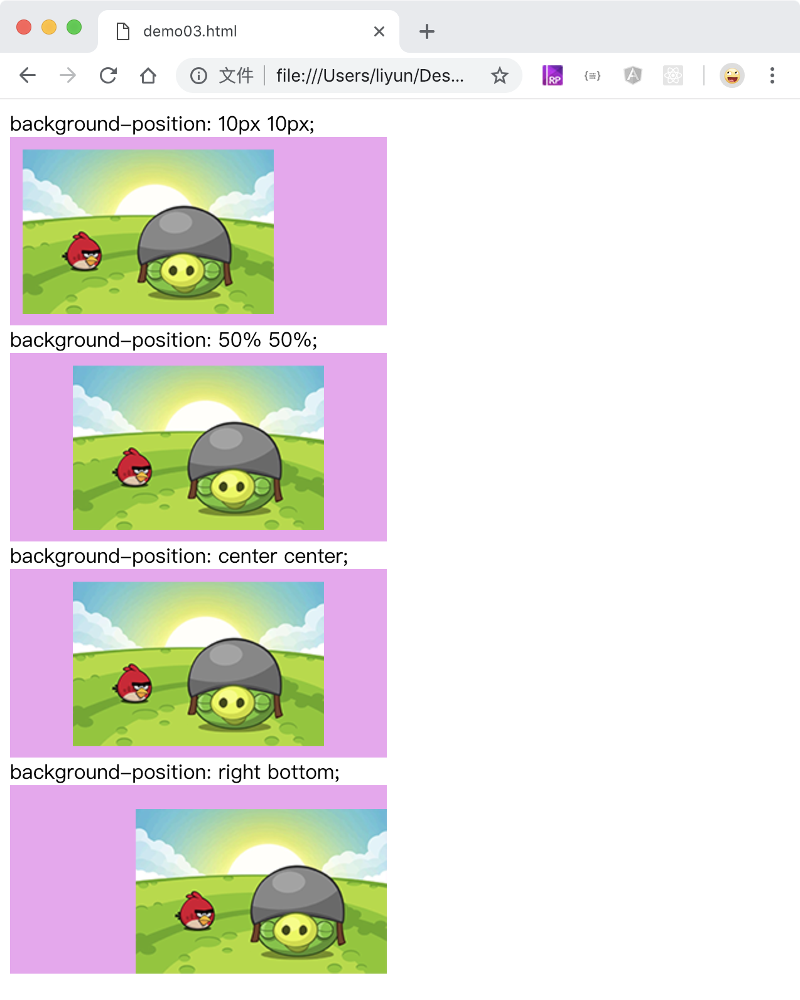

# 给 div 设置一个图片作为背景

`background-image:url()`属性用于给元素设置背景图。`url()`括号内，可以使用绝对路径、相对路径，或者网络文件

先看一下尺寸为`200*131`的原图：


```html
<style>
    div {
        width: 300px;
        height: 200px;
        background-image: url("./images/01.png");
    }
</style>
<div></div>
```

[案例源码](./demo/demo01.html)


从浏览器中可以看出，图片尺寸小于元素尺寸的时候，图片被水平方向和垂直方向平铺了出来。这些平铺的重复图片，可以通过`background-repeat`属性重新设置

## 去掉重复的背景图片

`background-repeat`属性用来设置背景图片在水平和垂直方向是否重复。

| 属性值      | 作用                             |
| ----------- | -------------------------------- |
| `repeat`    | 默认值，水平和垂直方向都重复     |
| `repeat-x`  | 只在水平方向重复                 |
| `repeat-y`  | 只在垂直方向重复                 |
| `no-repeat` | 去掉水平和垂直两个方向的重复效果 |

```html
<style>
    div {
        width: 300px;
        height: 200px;
        background-color: rgb(239, 163, 241);
        background-image: url("./images/01.png");
    }
    .p1 {
        background-repeat: repeat-x;
    }
    .p2 {
        background-repeat: repeat-y;
    }
    .p3 {
        background-repeat: no-repeat;
    }
</style>
repeat-x:
<div class="p1"></div>
repeat-y:
<div class="p2"></div>
no-repeat:
<div class="p3"></div>
```

[案例源码](./demo/demo02.html)


去掉重复效果之后，发现背景图片显示在元素的左上角，可以通过`background-position`属性来设置背景图片的位置

## 设置背景图的位置

`background-position: 水平位置 垂直位置`属性用来设置背景图片的位置

| 属性值 | 作用                                                               |
| ------ | ------------------------------------------------------------------ |
| length | 使用`px em rem`等单位设置位置                                      |
| %      | 分别以`元素宽减去背景图宽度和元素高减去背景图高度`的百分比设置位置 |
| left   | 水平方向靠左                                                       |
| right  | 水平方向靠右                                                       |
| top    | 垂直方向靠右                                                       |
| bottom | 垂直方向靠右                                                       |
| center | 居中 `center center`相当于`50% 50%`                                |

```html
<style>
    div {
        width: 300px;
        height: 150px;
        background-color: rgb(239, 163, 241);
        background-image: url("./images/01.png");
        background-repeat: no-repeat;
    }
    .p1 {
        background-position: 10px 10px;
    }
    .p2 {
        background-position: 50% 50%;
    }
    .p3 {
        background-position: center center;
    }
    .p4 {
        background-position: right bottom;
    }
</style>
background-position: 10px 10px;
<div class="p1"></div>
background-position: 50% 50%;
<div class="p2"></div>
background-position: center center;
<div class="p3"></div>
background-position: right bottom;
<div class="p4"></div>
```

[案例源码](./demo/demo03.html)


