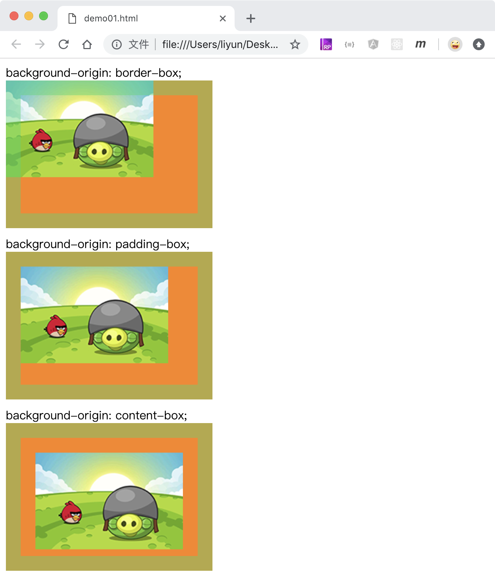

# 改变背景图的起始位置

`background-origin`属性用于修改背景图的开始位置。

| 属性值      | 作用                                              |
| ----------- | ------------------------------------------------- |
| padding-box | 默认值，表示图片的起始点从 padding 部分左上角开始 |
| border-box: | 表示图片的起始点从边框左上角开始                  |
| content-box | 表示图片的起始点从内容区域左上角开始              |

```html
<style>
    div {
        width: 200px;
        height: 120px;
        margin-bottom: 10px;
        padding: 20px;
        border: 20px solid rgba(28, 216, 106, 0.432);
        background-color: rgb(252, 133, 22);
        background-image: url("./images/01.png");
        background-repeat: no-repeat;
    }
    .p1 {
        background-origin: border-box;
    }
    .p2 {
        background-origin: padding-box;
    }
    .p3 {
        background-origin: content-box;
    }
</style>
background-origin: border-box;
<div class="p1"></div>
background-origin: padding-box;
<div class="p2"></div>
background-origin: content-box;
<div class="p3"></div>
```

[案例源码](./demo/demo01.html)


