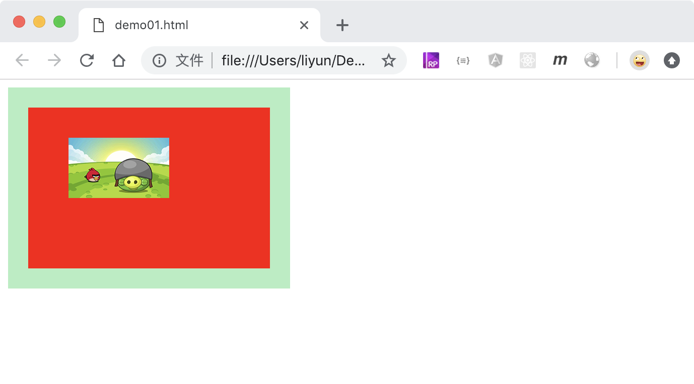

# 同时设置多个背景属性

`background`属性可以用来同时设置多个背景属性。

可以设置的属性分别是：`bg-color bg-image position/bg-size bg-repeat bg-origin bg-clip bg-attachment ;`.

```html
<style>
    div {
        width: 200px;
        height: 120px;
        margin-bottom: 10px;
        padding: 20px;
        border: 20px solid rgba(28, 216, 106, 0.432);
        background: red url("./images/01.png") 20px 10px/50% 50% content-box
            no-repeat padding-box;
    }
</style>
<div class="p1"></div>
```

> `background`可以选择性的设置一些属性，比如只设置背景颜色或者背景图片的路径都是可以的。没有设置的属性会使用默认值。

[案例源码](./demo/demo01.html)


