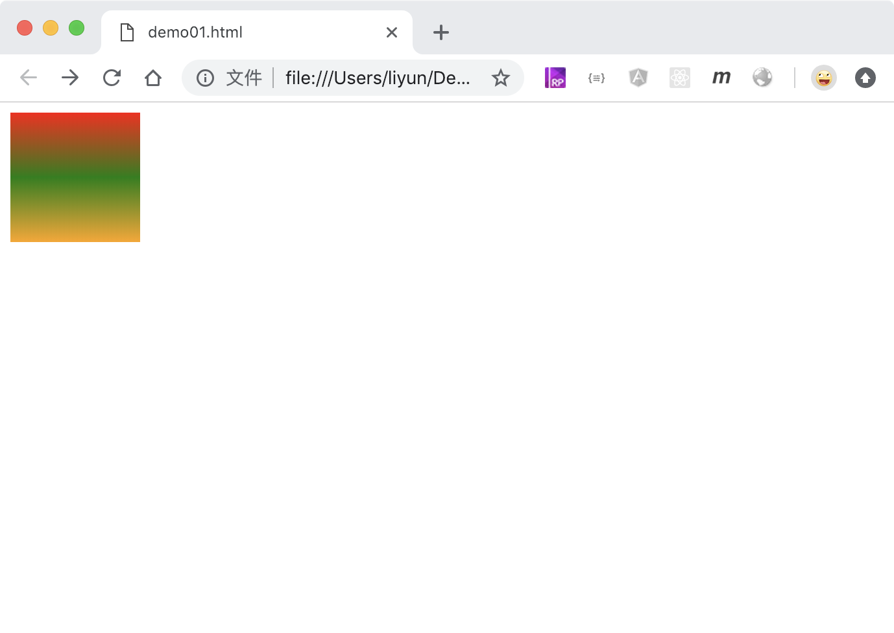
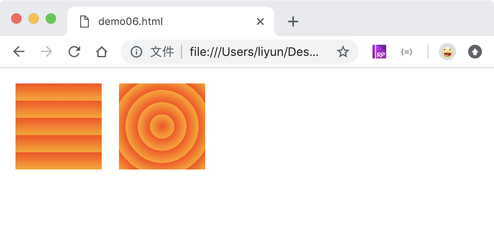

<!-- 2018-11-07 -->

# 给元素设置渐变色背景色

-   不能使用`background-color`
-   使用`background`属性
-   分为径向渐变和线性渐变两种

## 简单的线性渐变

格式：`background: linear-greadient(颜色1, 颜色2,颜色3, ...)`;

```html
<style>
    div {
        width: 100px;
        height: 100px;
        background: linear-gradient(red, green, orange);
    }
</style>
<div></div>
```

[案例源码](./demo/demo01.html)



## 调整线性渐变的方向

格式：`background: linear-greadient(方向, 颜色1, 颜色2, ...)`;

| 方向值                     | 作用                                            |
| -------------------------- | ----------------------------------------------- |
| XXdeg                      | 使用角度定义方向，默认值是 180deg，从上往下渐变 |
| `to left/right/top/bottom` | 使用单词定义方向                                |

```html
<style>
    div {
        width: 100px;
        height: 100px;
        margin: 10px;
        float: left;
    }

    div:nth-child(1) {
        background: linear-gradient(0deg, red, rgb(77, 0, 128));
    }
    div:nth-child(2) {
        background: linear-gradient(45deg, red, rgb(77, 0, 128));
    }
    div:nth-child(3) {
        background: linear-gradient(90deg, red, rgb(77, 0, 128));
    }
    div:nth-child(4) {
        background: linear-gradient(130deg, red, rgb(77, 0, 128));
    }
    div:nth-child(5) {
        background: linear-gradient(to left, red, rgb(77, 0, 128));
    }
    div:nth-child(6) {
        background: linear-gradient(to left top, red, rgb(77, 0, 128));
    }
</style>
<div></div>
<div></div>
<div></div>
<div></div>
<div></div>
<div></div>
```

[案例源码](./demo/demo02.html)


## 调整线性渐变颜色的位置

格式：`background: linear-greadient(方向, 颜色1 位置1, 颜色2 位置2, 颜色3 位置3, ...)`;

| 位置 | 作用                        |
| ---- | --------------------------- |
| 长度 | 使用 px、em、rem 等长度单位 |
| %    | 使用百分比设置颜色的位置    |

```html
<style>
    div {
        width: 100px;
        height: 100px;
        margin: 10px;
        float: left;
    }

    div:nth-child(1) {
        background: linear-gradient(90deg, red, yellow, orange);
    }

    /* 把黄色位置调整到20%的位置 */
    div:nth-child(2) {
        background: linear-gradient(90deg, red, yellow 20%, orange);
    }

    /* 同一个位置用两种颜色明显的分开 */
    div:nth-child(3) {
        background: linear-gradient(90deg, red, yellow 20%, pink 20%, orange);
    }

    /* 两边渐变，中间透明 */
    div:nth-child(4) {
        background: linear-gradient(
            90deg,
            red,
            yellow 20%,
            transparent 20%,
            transparent 40%,
            pink 40%,
            orange
        );
    }
</style>
<div></div>
<div></div>
<div></div>
<div></div>
```

[案例源码](./demo/demo03.html)


# 最简单的径向渐变

格式： `background: radial-gradient(颜色1, 颜色2, ...)`

```html
<style>
    div {
        width: 100px;
        height: 100px;
        background: radial-gradient(orange, red);
    }
</style>
<div></div>
```

[案例源码](./demo/demo04.html)


## 调整径向渐变的颜色位置

格式： `background: radial-gradient(颜色1 位置1, 颜色2 位置2, ...)`

```html
<style>
    div {
        width: 100px;
        height: 100px;
        margin: 10px;
        float: left;
    }

    div:nth-child(1) {
        background: radial-gradient(
            rgb(255, 72, 0),
            rgb(90, 255, 68),
            rgb(0, 38, 255)
        );
    }

    div {
        background: radial-gradient(
            rgb(255, 72, 0),
            rgb(90, 255, 68) 90%,
            rgb(0, 38, 255)
        );
    }
</style>
<div></div>
<div></div>
```

[案例源码](./demo/demo05.html)


## 重复多个渐变色

两种渐变色都可以设置重复显示

```html
<style>
    div {
        width: 100px;
        height: 100px;
        margin: 10px;
        float: left;
    }
    /* 重复线性渐变 */
    div:nth-child(1) {
        background: repeating-linear-gradient(rgb(255, 72, 0), orange 20%);
    }
    /* 重复径向渐变 */
    div {
        background: repeating-radial-gradient(rgb(255, 72, 0), orange 20%);
    }
</style>
<div></div>
<div></div>
```


