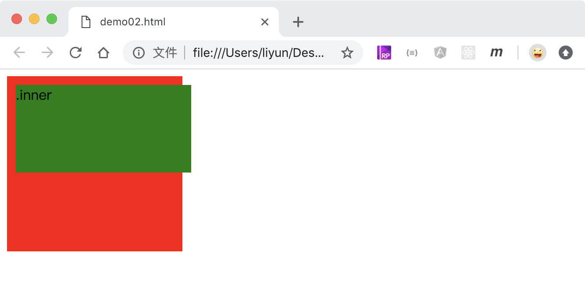
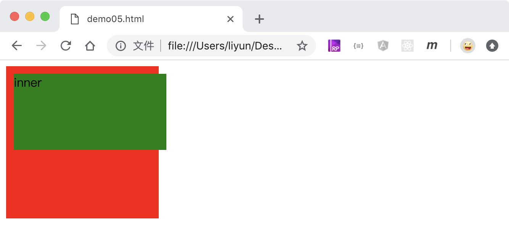
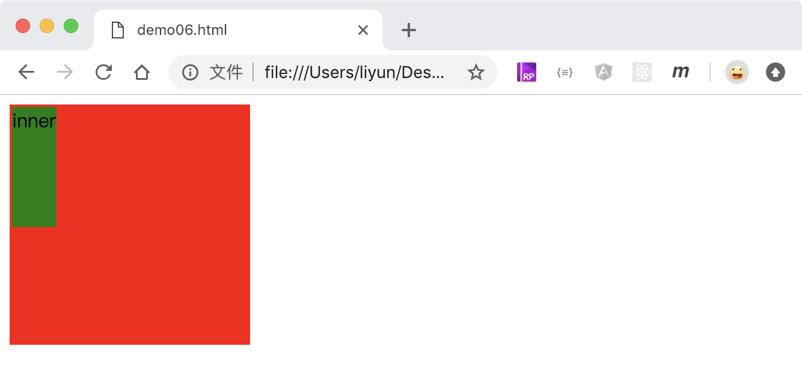

# CSS 中的定位

`position`属性用来把元素从`标准文档流`中独立出来，配合`left,right,top,right`属性设置元素的位置

| 属性值   | 作用                                                                                   |
| -------- | -------------------------------------------------------------------------------------- |
| static   | 默认值，不使用定位，left、right、top、bottom、z-index 属性都会失效                     |
| relative | 相对定位，以元素标准位置为参照物                                                       |
| absolute | 绝对定位，以最近**使用了定位**的元素作为参照物，如果没有找到，则以 html 标签作为参照物 |
| fixed    | 固定定位，以浏览器可显示区域作为参照物                                                 |
| sticky   | 粘性定位，当元素靠近浏览器边缘的时候会被“卡住”                                         |

在默认的页面中，盒子按照从上到下，从左到右的顺序相继排列显示，可以看做是`标准文档流`。默认值`static`之外的属性值，即可以看做是元素从`标准文档流`中脱离了出来，单独设置元素的位置。

元素从`标准文档流`中脱离出来之后，不再占用页面空间，标准文档流中的元素会被该元素遮挡住。

## 绝对定位

绝对定位会使用**最近的使用了定位属性**的元素作为参照物

```html
<style>
    .div1 {
        position: relative;
        width: 200px;
        height: 200px;
        background-color: aqua;
    }
    .div1 p {
        position: absolute;
        top: 10px;
        left: 10px;
        background-color: blueviolet;
    }
    .div2 {
        position: absolute;
        top: 20px;
        left: 220px;
        width: 100px;
        height: 100px;
        background-color: green;
    }
    .div3 {
        position: absolute;
        top: 20px;
        left: 400px;
        width: 100px;
        height: 100px;
        background-color: orange;
    }
    .div4,
    .div7 {
        position: absolute;
        top: 20px;
        left: 400px;
        width: 100px;
        height: 100px;
        background-color: orange;
    }
    .div6 {
        position: fixed;
        top: 200px;
        left: 400px;
        width: 100px;
        height: 100px;
        background-color: rgb(0, 89, 255);
    }
</style>
<!-- p元素的父级 -->
<div class="div1"><p>we are family</p></div>

<!-- div2的祖先元素中没有元素拥有定位属性，所以会以页面根节点作为参照物去定位 -->
<div class="div2">div2</div>

<div class="div3">
    div3
    <div class="div4">div4</div>
</div>
<div class="div6">
    div6
    <div class="div7">div7</div>
</div>
```

在上面的案例中，使用了`position:absolute`属性的元素，浏览器会逐层向上查找，如果发现了拥有定位属性的元素会以该元素作为参照物，如果没有，会以页面根节点(html 元素)作为参照物。

[案例源码](./demo/demo01.html)


## 相对定位

`position:relative`会把元素以自身的标准位置作为参照物，进行移动

```html
<style>
    .outer {
        width: 200px;
        height: 200px;
        background-color: red;
    }
    .inner {
        height: 100px;
        background-color: green;
        position: relative;
        top: 10px;
        left: 10px;
    }
</style>
<div class="outer">
    <div class="inner">.inner</div>
</div>
```

[案例源码](./demo/demo02.html)



## 固定定位

`position:fixed`会把元素固定在浏览器窗口可视区域的某个位置，并且该位置不随页面内容的滚动而变化

```html
<style>
    body {
        height: 1000px;
    }
    .outer {
        width: 200px;
        height: 200px;
        background-color: red;
        position: fixed;
    }
</style>
<div class="outer"></div>
```

[案例源码](./demo/demo03.html)可以自行在浏览器中打开查看

## 粘性定位

`position:sticky`属性，会在元素贴近浏览器可是区域边缘的时候，固定其位置，不随页面滚动而发生变化。

```html
<style>
    body {
        height: 1000px;
    }
    .outer {
        width: 200px;
        height: 200px;
        background-color: red;
        position: sticky;
        left: 50%;
        top: 10px;
    }
</style>
<p>we are family</p>
<div class="outer"></div>
<p>we are family</p>
```

[案例源码](./demo/demo04.html)可以自行在浏览器中打开查看

## 相对定位后元素的默认宽度

绝对定位后元素的默认宽度为父级宽度的 100%，高度为 0

```html
<style>
    .outer {
        width: 200px;
        height: 200px;
        background-color: red;
    }
    .inner {
        height: 100px;
        background-color: green;
        position: relative;
    }
</style>
<div class="outer"><div class="inner"></div></div>
```

[案例源码](./demo/demo05.html)



## 绝对定位后元素的默认宽度

绝对定位后元素的默认宽度为 0，高度为 0

```html
<style>
    .outer {
        width: 200px;
        height: 200px;
        background-color: red;
        position: relative;
    }
    .inner {
        height: 100px;
        background-color: green;
        position: absolute;
    }
</style>
<div class="outer"><div class="inner"></div></div>
```

[案例源码](./demo/demo06.html)



## 使用百分比设置位置

```html
<style>
    .outer {
        width: 200px;
        height: 200px;
        background-color: red;
    }
    .inner {
        width: 100px;
        height: 100px;
        background-color: green;
        position: relative;
        left: 100%;
        top: 100%;
    }
</style>
<div class="outer"><div class="inner"></div></div>
```

[案例源码](./demo/demo07.html)


```html
<style>
    .outer {
        width: 200px;
        height: 200px;
        background-color: red;
        position: relative;
    }
    .inner {
        width: 100px;
        height: 100px;
        background-color: green;
        position: absolute;
        left: 100%;
        top: 100%;
    }
</style>
<div class="outer"><div class="inner"></div></div>
```

[案例源码](./demo/demo08.html)


上面的两段代码可以看出，不管是绝对定位还是相对定位，位置属性值如果使用了百分比，会以父级元素的宽度和高度作为参照物来计算。
