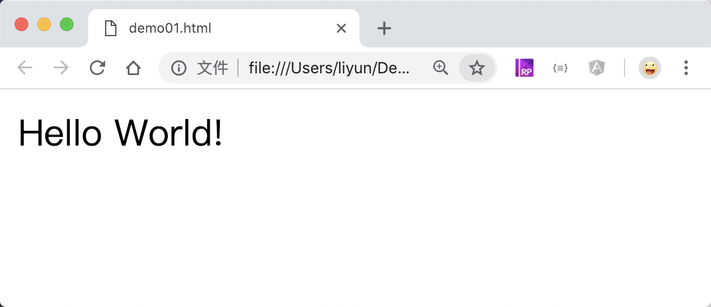
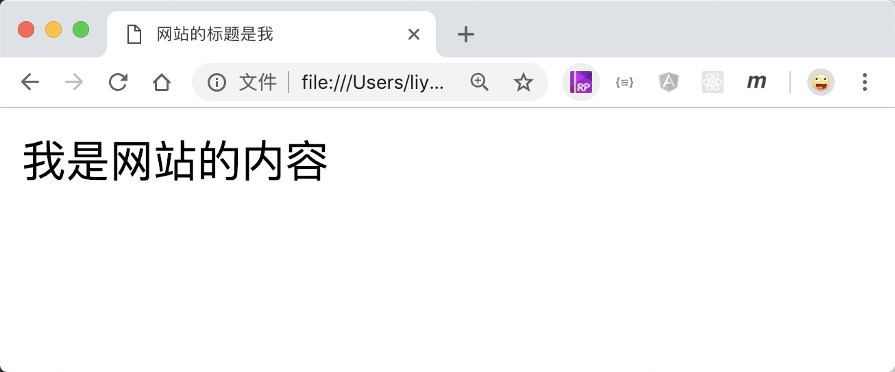

# html 基础结构

HTML 文件由标签、文本、注释组成

```html
<!-- html 是页面的根元素 -->
<html>
    <head>
        <!-- 
            头部 ：
            1、文档的头部描述了文档的各种属性和信息，包括文档的标题等。
            2、绝大多数文档头部包含的数据都不会真正作为内容显示给读者
        -->
    </head>

    <body>
        <p>Hello World!</p>
        <!-- 
            网页的主要内容放在这个里面,会显示在浏览器的页面中
         -->
    </body>
</html>
```

[案例源码](./demo/demo01.html)



## 标签

标签由`<标签名>`组成。比如`<p>`、`<div>`等。

标签分为“单标签”和“双标签”两种，双标签就是上面案例中的`<html></html>`、`<head></head>`、`<body></body>`等，也被称为“标签对”，由一个`开始标签`和一个`结束标签`组成。

单标签又叫“自闭合标签”，比如以后会讲的`<br/>`，单标签没有结束标签，但是需要在开始标签的大于号前面添加一个`/`符号。

HTML 标签中有一些标签自带了样式,比如加粗、倾斜、上划线、下划线等等。

每组标签都在页面中生成一个对应的`元素`。

## <html> 标签

1、html 文件由标签、文本、注释组成
2、html 标签是整个文档的根标签，所有的标签都要写在 html 标签之间

## <head> 标签

文档的头部描述了文档的各种属性和信息，包括文档的标题等。

绝大多数文档头部包含的数据都不会真正作为内容显示给读者。

`<head>`标签中最常用的是`<title>`标签，主要用来定义当前访问页面的标题信息。

```html
<html>
    <head>
        <title>网站的标题是我</title>
    </head>
    <body>
        我是网站的内容
    </body>
</html>
```

[案例源码](./demo/demo02.html)



## <body> 标签

在网页上要展示出来的页面内容一定要放在 body 标签中。

## 注释

HTML 文档中有一些文字是给开发人员看的，不会在浏览器中显示，这些内容需要用特殊的符号包括起来，这种操作被称为“注释”

HTML 中注释一段文字需要使用`<!-- -->`格式，包含在该格式中的内容不会显示在浏览器中

```html
<html>
    <head> </head>
    <body>
        这里的文字会显示在浏览器中，
        <!-- 这里的文字不会显示在浏览器中 -->
    </body>
</html>
```

[案例源码](./demo/demo03.html)


