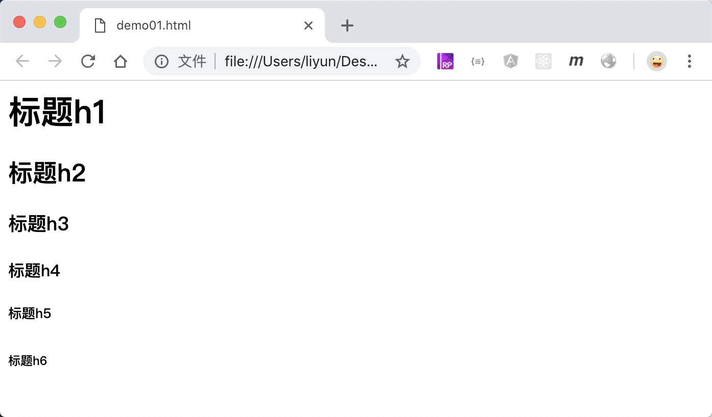

# 用 Hx 标签插入一个标题

Hx 标签并不是真的有`<hx>`这个标签，而是`<h1></h1>`、`<h2></h2>`、`<h3></h3>`、`<h4></h4>`、`<h5></h5>`、`<h6></h6>`等 6 种标签的统称。

Hx 标签主要用来在页面中插入一个`标题`。Hx 标签自带了一个加粗样式，并且从`h1`到`h6`开始，文字的大小会依次变小。也就意味着`h1`标签常用来定义最重要的标题，`h6`标签从来定义一些重要等级低的标题。

```html
<h1>标题h1</h1>
<h2>标题h2</h2>
<h3>标题h3</h3>
<h4>标题h4</h4>
<h5>标题h5</h5>
<h6>标题h6</h6>
```

[案例源码](./demo/demo01.html)


