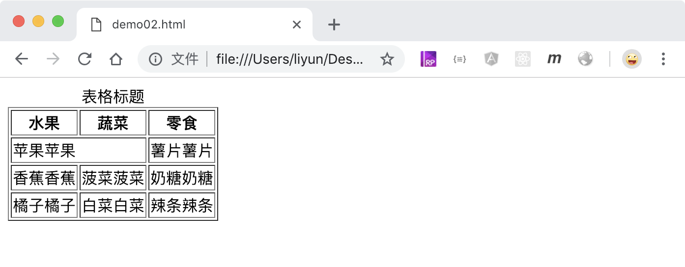
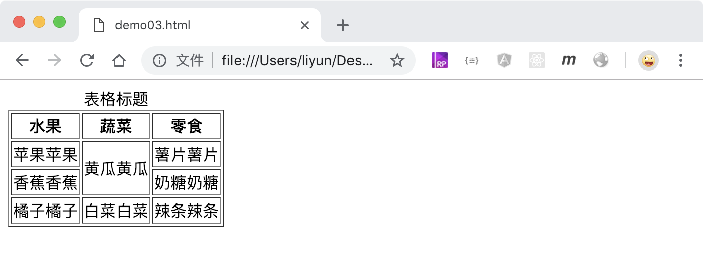

# 用 table 插入一个表格

`<table>`标签主要用来在页面中插入表格，需要和它配合使用标签有：

| 标签名      | 作用                                                  |
| ----------- | ----------------------------------------------------- |
| `<caption>` | 定义表格的标题                                        |
| `<thead>`   | 定义表格的表头部分，包含 `<tr>`和`<th>`标签           |
| `<tbody>`   | 定义表格的内容部分，包含 `<tr>`和`<td>`标签           |
| `<tr>`      | 定义表格中的`行`                                      |
| `<th>`      | 定义表格头中的`单元格`，自带加粗样式 ，并且会居中显示 |
| `<td>`      | 定义表格内容中的`单元格`，                            |

```html
<table border="1">
    <caption>
        表格标题
    </caption>
    <thead>
        <tr>
            <th>水果</th>
            <th>蔬菜</th>
            <th>零食</th>
        </tr>
    </thead>
    <div class="tbody">
        <tr>
            <td>苹果苹果</td>
            <td>黄瓜黄瓜</td>
            <td>薯片薯片</td>
        </tr>
        <tr>
            <td>香蕉香蕉</td>
            <td>菠菜菠菜</td>
            <td>奶糖奶糖</td>
        </tr>
        <tr>
            <td>橘子橘子</td>
            <td>白菜白菜</td>
            <td>辣条辣条</td>
        </tr>
    </div>
</table>
```

[案例源码](./demo/demo01.html)


## border 属性

`border`属性用来给表格内容整体和单元格设置一个边框，这个边框也可以通过 CSS 设置样式

## 合并单元格

可以通过给`td`标签添加`colspan`和`rowspan`属性，对单元格进行合并，其中`colspan`表示列与列之间的合并，`rowspan`表示行与行之间的合并。

## 合并列

```html
<table border="1">
    <caption>
        表格标题
    </caption>
    <thead>
        <tr>
            <th>水果</th>
            <th>蔬菜</th>
            <th>零食</th>
        </tr>
    </thead>
    <div class="tbody">
        <tr>
            <td colspan="2">苹果苹果</td>
            <td>薯片薯片</td>
        </tr>
        <tr>
            <td>香蕉香蕉</td>
            <td>菠菜菠菜</td>
            <td>奶糖奶糖</td>
        </tr>
        <tr>
            <td>橘子橘子</td>
            <td>白菜白菜</td>
            <td>辣条辣条</td>
        </tr>
    </div>
</table>
```

[案例源码](./demo/demo02.html)



## 合并行

```html
<table border="1">
    <caption>
        表格标题
    </caption>
    <thead>
        <tr>
            <th>水果</th>
            <th>蔬菜</th>
            <th>零食</th>
        </tr>
    </thead>
    <div class="tbody">
        <tr>
            <td>苹果苹果</td>
            <td rowspan="2">黄瓜黄瓜</td>
            <td>薯片薯片</td>
        </tr>
        <tr>
            <td>香蕉香蕉</td>
            <td>奶糖奶糖</td>
        </tr>
        <tr>
            <td>橘子橘子</td>
            <td>白菜白菜</td>
            <td>辣条辣条</td>
        </tr>
    </div>
</table>
```

[案例源码](./demo/demo03.html)


