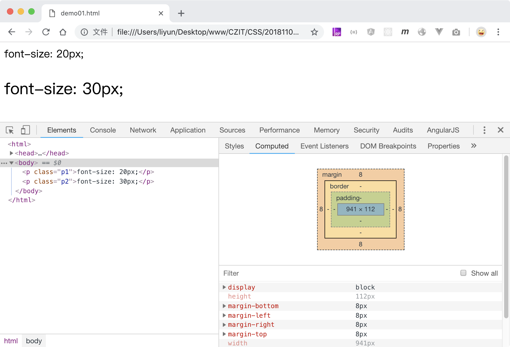
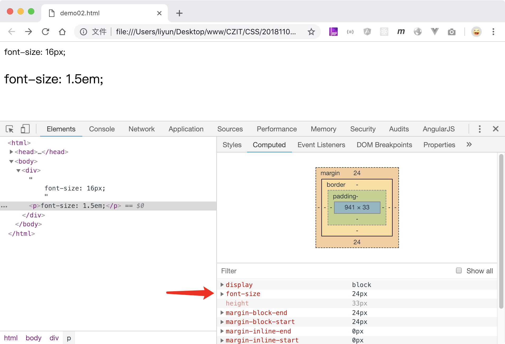

# CSS 中的尺寸

CSS 中常见的尺寸单位有：

| 单位案例 | 意义                                                     |
| -------- | -------------------------------------------------------- |
| 1px      | 在电脑浏览器中没有任何缩放情况下的 1 个物理像素          |
| 1em      | 字号属性是父级元素的 1 倍，其他属性是元素本身字号的 1 倍 |
| 1rem     | 页面根标签`html`字号的 1 倍                              |
| 1vw      | 页面可视区域宽度的百分之一                               |
| 1vh      | 页面可视区域高度的百分之一                               |

常见的标准浏览器默认文字尺寸是`16px`。万一用户用了非标准浏览器，默认字号可能会有一些改变，所以通常情况下，会给 html 标签设置一个默认的字号，方便统一样式。

> CSS 中设置字体大小的属性为`font-size`.

```css
html {
    font-size: 16px;
}
```

## 1px

使用`px`作为单位是，数字越大，字号越大

```html
<style>
    .p1 {
        font-size: 20px;
    }
    .p2 {
        font-size: 30px;
    }
</style>
<p class="p1">we are family</p>
<p class="p2">we are family</p>
```

[案例源码](./demo/demo01.html)



## 1em

`font-size`属性值使用`em`作为单位时，会用父级元素的字号乘以`em`前面的倍数。

如果父级元素字号 `16px`，子级元素设置了`1.5em`，最终生成自元素的字号就是`24px`

> 其他属性值如果使用`em`作为单位，则会以元素本身的字号尺寸乘以`em`前面的数字，作为最终结果.

```html
<style>
    div {
        font-size: 16px;
    }
    p {
        font-size: 1.5em;
    }
</style>

<div>
    we are family;
    <p>we are family</p>
</div>
```

[案例源码](./demo/demo02.html)



## 1rem

任何 CSS 属性值如果使用了`rem`作为单位，都会以`html`元素的字号乘以`rem`前面的数字作为最终尺寸

```html
<style>
    html {
        font-size: 18px;
    }
    div {
        font-size: 1.5rem;
    }
    p {
        font-size: 2rem;
    }
</style>

<div>font-size: 1.5rem;</div>
<p>font-size: 2rem;</p>
```

[案例源码](./demo/demo03.html)


