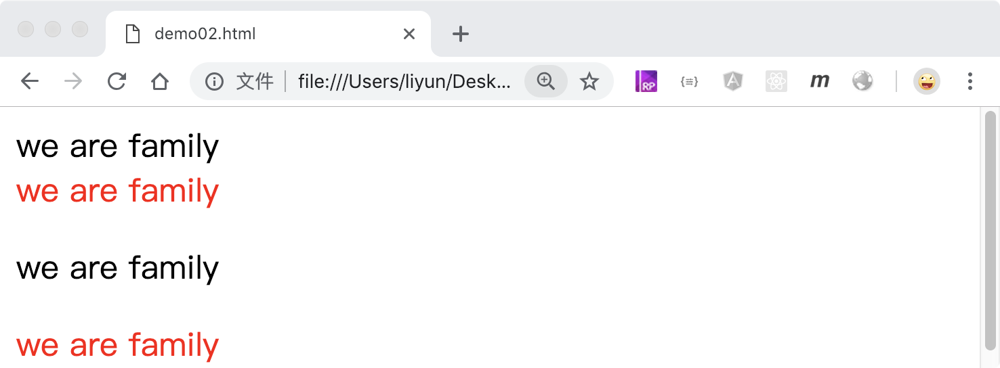
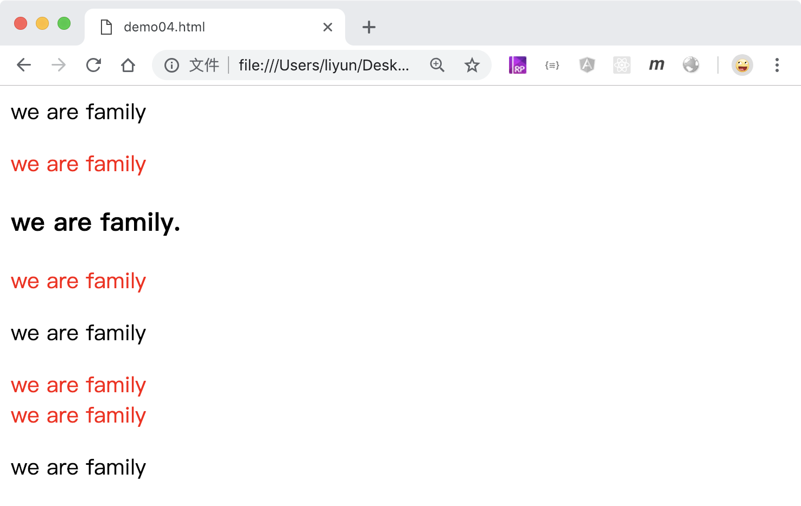

# CSS 关系选择器

CSS 中有一种关系选择器，用来在指定元素的子元素或者后代元素中查找符合选择器规则的元素。

## 后代选择器

`A B`:选择 B 元素，B 元素必须是 A 元素的后代元素

```html
<style>
    /* 选择div元素后代中的所有span元素 */
    div span {
        color: red;
    }
</style>
<span>we are family</span>
<div>
    <span>we are family</span>
    <p><span>we are family</span></p>
    <span>we are family</span>
</div>
```

[案例源码](./demo/demo01.html)


## 子代选择器

`A>B`:选择 B 元素，B 元素必须是 A 元素的直接子元素

```html
<style>
    /* 选择div元素后代中的所有span元素 */
    div span {
        color: red;
    }
</style>
<span>we are family</span>
<div>
    <span>we are family</span>
    <p><span>we are family</span></p>
    <span>we are family</span>
</div>
```

[案例源码](./demo/demo02.html)



## 相邻兄弟选择器

`A+B`:选择 B 元素，B 元素必须是跟在 A 元素后面的第一个元素

> 注意，大括号内的样式会设置给加号后面的元素！

```html
<style>
    /* 选择所有p元素后面的div元素 */
    p + div {
        color: red;
    }
</style>
<p>we are family</p>
<div>we are family</div>
<p>we are family</p>
<h3>we are family</h3>
<p>we are family</p>
<div>we are family</div>
```

[案例源码](./demo/demo03.html)


## 多个兄弟选择器

`A~B`:选择 B 元素，B 元素必须是紧跟在 A 元素后面的一个或连续多个相同选择器规则的元素

> 注意： 大括号内的样式会设置给`~`后面的元素。

```html
<style>
    /* 选择所有p元素后面连续的div元素 */
    p ~ div {
        color: red;
    }
</style>
<p>we are family</p>
<div>we are family</div>
<p>we are family</p>
<div>we are family</div>
<div>we are family</div>
<p>we are family</p>
```

[案例源码](./demo/demo04.html)


