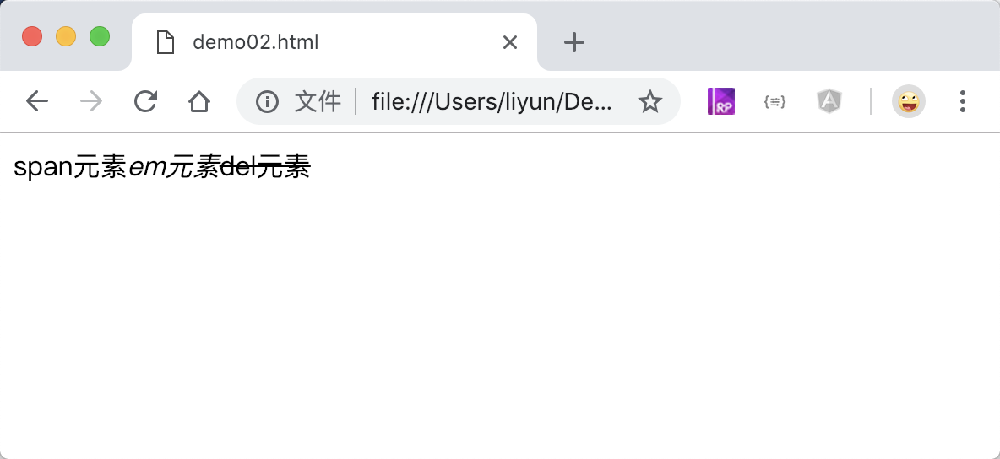
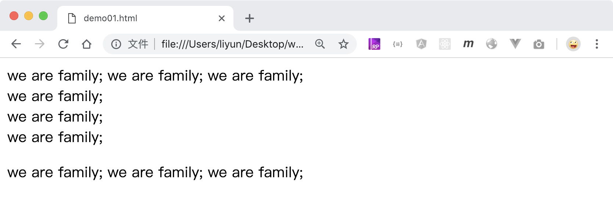

# 元素的分类

一个网页由许多标签组成，这些标签形成的元素在页面中，默认按照从上到下，从左到右的方式排列，浏览器给每个元素都设置了一个默认值，元素会按照这个默认值，来决定上下排列还是左右排列。

这些元素根据默认显示方式，大致分为三类：

-   块级元素
-   行内元素(“内联元素”)，
-   行内块元素

## 块级元素

-   块级元素默认的宽度和父级元素的内容宽度保持一致
-   块级元素和它后面的元素都会在页面中另起一行，

比如`div p Hx`等等。

```html
<div>div元素独占一行</div>
<p>p元素独占一行</p>
<h1>h1元素独占一行</h1>
```

[案例源码](./demo/demo01.html)


## 行内元素

-   多个内联元素会在同一行显示，并在超过父级宽度的时候自动换行

比如`i em u ins s del a span`等等

```html
<span>span元素</span><em>em元素</em><del>del元素</del>
```

[案例源码](./demo/demo02.html)



## 行内块元素

-   多个行内快元素会在同一行显示，并在超过父级宽度的时候自动换行

> 块级元素、行内元素和行内块元素还有一个区别在于：块级元素和行内块元素可以定义元素的宽度和高度，行内元素则不能直接设置宽高，后面会讲到。

## 切换显示方式

这些显示方式都是通过`display`属性设置的，属于浏览器的内置样式，我们可以通过手动设置`display`的属性值来修改元素的显示方式：

| 属性值         | 作用                 |
| -------------- | -------------------- |
| `none`         | 不在页面中显示元素   |
| `block`        | 把元素改为块级元素   |
| `inline`       | 把元素改为行内元素   |
| `inline-block` | 把元素改为行内块元素 |

```html
<style>
    div {
        display: inline;
    }
    span {
        display: block;
    }
    p {
        display: inline-block;
    }
</style>

<div>we are family;</div>
<div>we are family;</div>
<div>we are family;</div>

<span>we are family;</span><span>we are family;</span
><span>we are family;</span>

<p>we are family;</p>
<p>we are family;</p>
<p>we are family;</p>
```

[案例源码](./demo/demo03.html)



> 上面案例中`div`元素默认是块级元素,会独占一行的，通过`display:inline`，它变成了一个行内元素，就会遵从行内元素的规则，多个元素在同一行显示

`display`属性实际上还有很多属性值，都是不太常用的，可以[点击这里](https://developer.mozilla.org/zh-CN/docs/Web/CSS/display)查看
