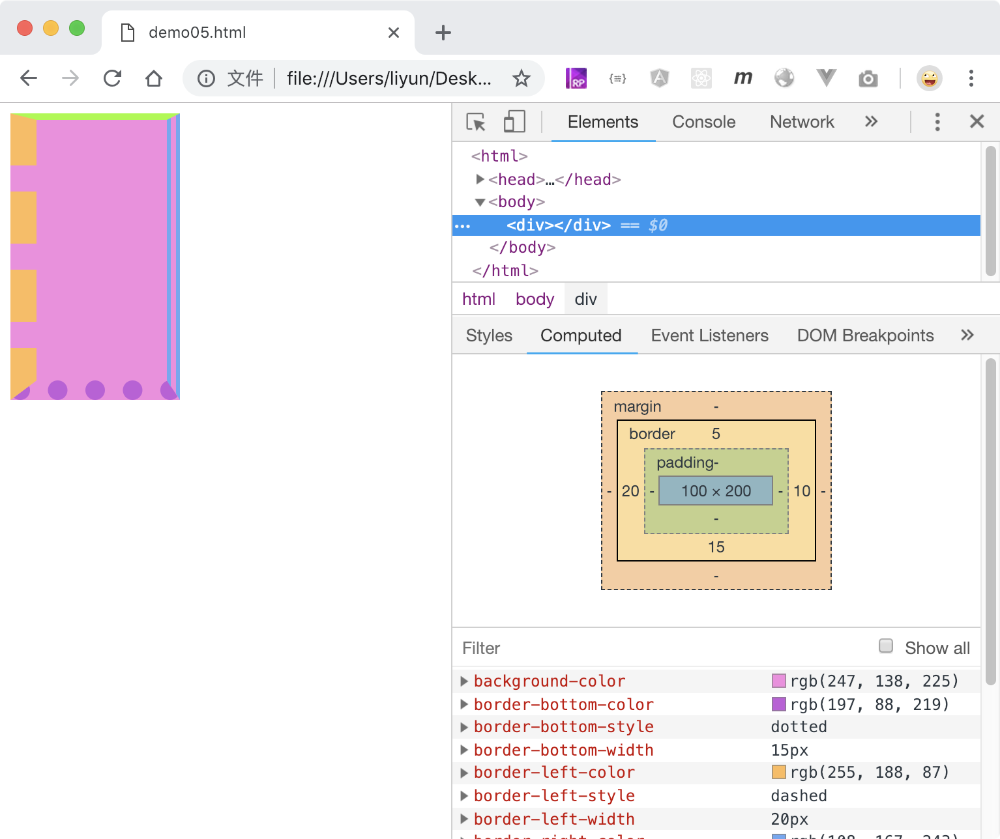

# 边框

`border:`属性用来设置元素的边框，默认值是`none`, 支持以下几种写法:

-   `border:宽度 样式 颜色`
-   `border-width: 边框宽度`
-   `border-style: 边框样式`:常见的有：实线(`solid`)、双实线(`double`)、点线(`dotted`)、虚线(`dashed`)
-   `border-color: 边框颜色`
-   `border-top-width: 上边框宽度`
-   `border-top-style: 上边框样式`
-   `border-top-color: 上边框颜色`
-   `border-right-width: 右边框宽度`
-   `border-right-style: 右边框样式`
-   `border-right-color: 右边框颜色`
-   `border-bottom-width: 下边框宽度`
-   `border-bottom-style: 下边框样式`
-   `border-bottom-color: 下边框颜色`
-   `border-left-width: 左边框宽度`
-   `border-left-style: 左边框样式`
-   `border-left-color: 左边框颜色`

```html
<style>
    div {
        width: 100px;
        height: 200px;
        background-color: rgb(247, 138, 225);
        border-width: 5px 10px 15px 20px;
        border-style: solid double dotted dashed;
        border-color: rgb(153, 252, 40) rgb(108, 167, 243) rgb(197, 88, 219) rgb(
                255,
                188,
                87
            );
    }
</style>
<div></div>
```

[案例源码](./demo/demo01.html)



## 边框的妙用案例

使用边框的属性，可以实现一个简单的三角形箭头。

```html
<style>
    div {
        width: 0;
        border: 10px solid rgb(230, 113, 224);
    }
    .p1 {
        border-top-color: transparent;
        border-right-color: transparent;
        border-left-color: transparent;
    }
    .p2 {
        border-top-color: transparent;
        border-bottom-color: transparent;
        border-left-color: transparent;
    }
    .p3 {
        border-top-color: transparent;
        border-bottom-color: transparent;
        border-right-color: transparent;
    }
    .p4 {
        border-bottom-color: transparent;
        border-right-color: transparent;
        border-left-color: transparent;
    }
</style>
<div class="p1"></div>
<div class="p2"></div>
<div class="p3"></div>
<div class="p4"></div>
```

[案例源码](./demo/demo02.html)


