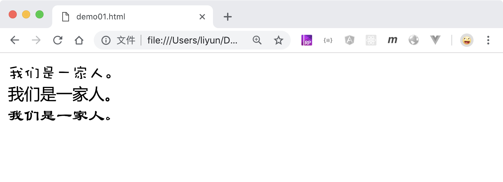

# 设置文字的字体

`font-family`属性可以设置文字的显示字体。

```html
<style>
    .p1 {
        font-family: "Wawati SC";
    }
    .p2 {
        font-family: "Microsoft YaHei";
    }
    .p3 {
        font-family: "Baoli SC";
    }
</style>
<div class="p1">我们是一家人。</div>
<div class="p2">我们是一家人。</div>
<div class="p3">我们是一家人。</div>
```

[案例源码](./demo/demo01.html)



## 设置多个字体

开发人员设置的字体，用户可能没有安装，可以给元素同时设置多个字体，浏览器会从前往后在在电脑中查找，如果在电脑中找到了其中一个字体，元素会使用这个字体显示在浏览器中，如果设置的字体都没有找到，会使用浏览器指定的默认字体。最终使用的字体也可以在开发者工具的`element-computed`面板中看到

```html
<style>
    div {
        font-family: "Yahei SC", "Meiyou SC", "Wawati SC";
    }
</style>
<div>我们是一家人。</div>
```

[案例源码](./demo/demo02.html)


## 在 PS 中获取字体的英文名称

在某些时候，电脑的字体文件夹中显示的是字体的中文名称，放到`font-family`中没有生效，可以尝试在 PS 软件中用该字体输入一些文字，在图层上点击右键，选择`复制CSS`，即可拿到字体的英文名称。


