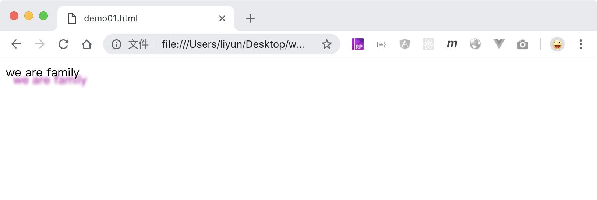

# 给文字添加阴影和轮廓

`text-shadow: X 轴偏移距离 Y 轴偏移距离 模糊距离 颜色`属性用来给文字设置阴影。

```html
<style>
    p {
        text-shadow: 10px 10px 5px orange;
    }
</style>
<p>we are family</p>
```

[案例源码](./demo/demo01.html)



## 多个阴影

阴影可以一次性添加多个，中间用逗号分隔

```html
<style>
    p {
        text-shadow: 10px 10px 3px rgb(182, 3, 167), -10px -10px 3px rgb(45, 99, 201);
    }
</style>
<p>we are family</p>
```

[案例源码](./demo/demo02.html)


## 轮廓

格式：text-outline: 宽度 模糊半径 颜色；

-   截止目前，chrome 和 firefox 浏览器实都没有实现这个功能
