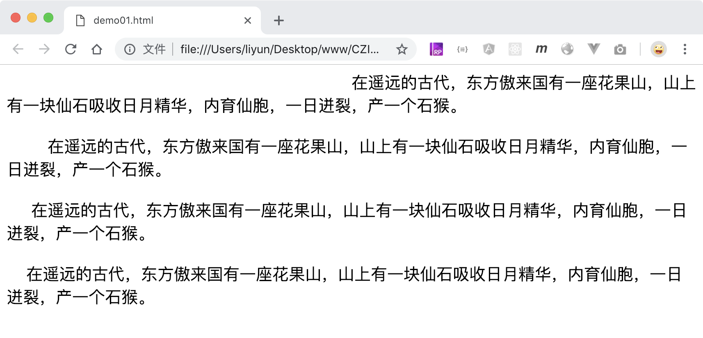

# 设置段落的首行缩进效果

`text-index`属性用来设置首行缩进的距离

| 属性值 | 作用                               |
| ------ | ---------------------------------- |
| length | 使用`px em rem`等长度单位设置行高  |
| %      | 基于当前字体尺寸的百分比设置行高。 |

```html
<style>
    html {
        font-size: 16px;
    }
    div {
        font-size: 20px;
    }
    .p1 {
        text-indent: 50%; /* 缩进距离是父级元素宽度的一半 */
    }
    .p2 {
        text-indent: 50px;
    }
    .p3 {
        text-indent: 1.5em; /* 最终缩进30px */
    }
    .p4 {
        text-indent: 1.5rem; /* 最终缩进24px */
    }
</style>

<div class="p1">
    在遥远的古代，东方傲来国有一座花果山，山上有一块仙石吸收日月精华，内育仙胞，一日迸裂，产一个石猴。
</div>
<br />
<div class="p2">
    在遥远的古代，东方傲来国有一座花果山，山上有一块仙石吸收日月精华，内育仙胞，一日迸裂，产一个石猴。
</div>
<br />
<div class="p3">
    在遥远的古代，东方傲来国有一座花果山，山上有一块仙石吸收日月精华，内育仙胞，一日迸裂，产一个石猴。
</div>
<br />
<div class="p4">
    在遥远的古代，东方傲来国有一座花果山，山上有一块仙石吸收日月精华，内育仙胞，一日迸裂，产一个石猴。
</div>
```

[案例源码](./demo/demo01.html)


