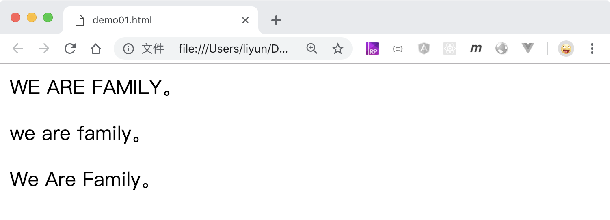

## 设置英文字母的大小写

`text-transform`属性可以设置文字中英文字母的大小写方式

| 属性值       | 作用                           |
| ------------ | ------------------------------ |
| `none`       | 默认值，不对英文字母做任何修改 |
| `uppercase`  | 全部转为大写                   |
| `lowercase`  | 全部转为小写                   |
| `capitalize` | 只把首字母大写                 |

```html
<style>
    .p1 {
        text-transform: uppercase;
    }
    .p2 {
        text-transform: lowercase;
    }
    .p3 {
        text-transform: capitalize;
    }
</style>

<p class="p1">we are family。</p>
<p class="p2">WE ARE FAMILY。</p>
<p class="p3">we are family。</p>
```

[案例源码](./demo/demo01.html)


