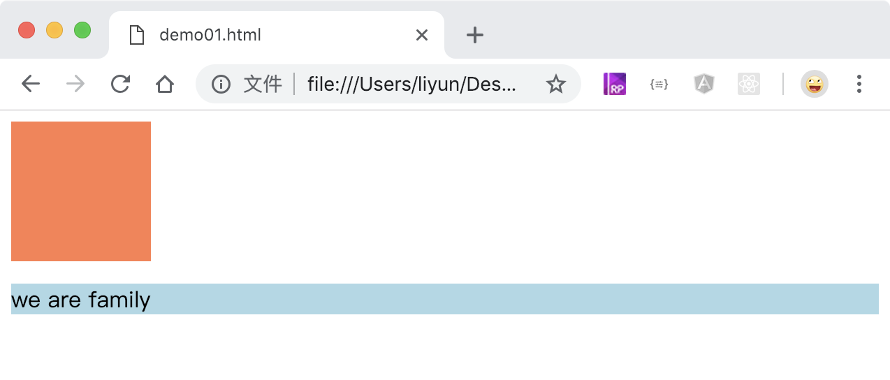

# 给元素设置背景颜色

`background-color`属性用于给元素设置背景颜色。

```html
<style>
    div {
        width: 100px;
        height: 100px;
        background-color: coral;
    }
    p {
        background-color: lightblue;
    }
</style>
<div></div>
<p>we are family</p>
```

[案例源码](./demo/demo01.html)


