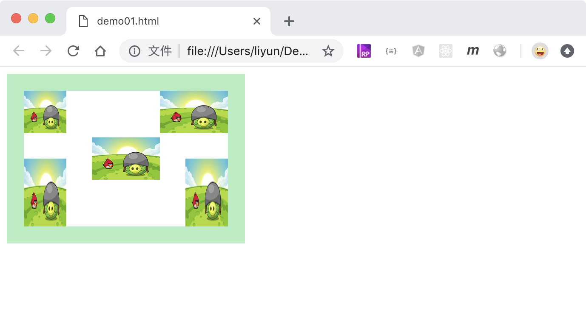
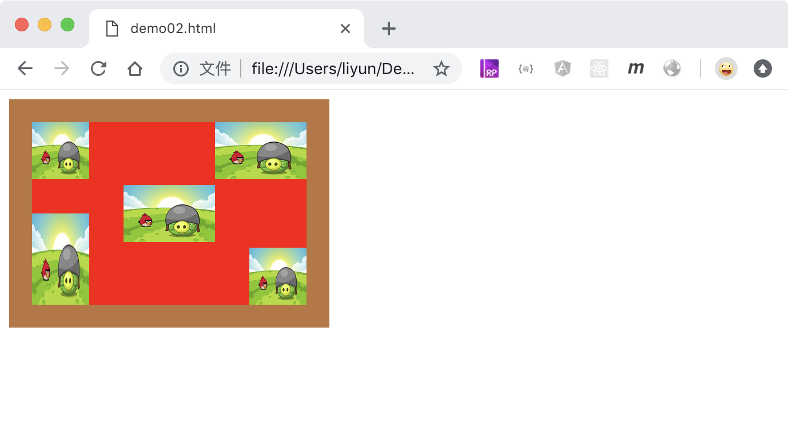

# 给元素设置多张背景图

给元素设置多张背景图有两种方式，一种是利用`background`属性一次性设置多个属性，另一种就是分开设置背景图及其他属性

## 使用`background`属性设置：

```html
<style>
    div {
        width: 200px;
        height: 120px;
        margin-bottom: 10px;
        padding: 20px;
        border: 20px solid rgba(28, 216, 106, 0.432);
        background: url("./images/01.png") no-repeat left top/50px 50px, url("./images/01.png")
                no-repeat right top/80px 50px,
            url("./images/01.png") no-repeat left bottom/50px 80px, url("./images/01.png")
                no-repeat right top/50px 50px,
            url("./images/01.png") no-repeat center center/80px 50px, url("./images/01.png")
                no-repeat right bottom/50px 80px;
    }
</style>
<div></div>
```

> 注意：如果想在这种方式中同时添加背景颜色，可以把颜色写在属性值的最后，用逗号隔开：`background:图片1,图片2,颜色`

[案例源码](./demo/demo01.html)



## 使用详细属性分别设置

> 注意：对应的背景图片属性之间，要用逗号分隔开来！

```html
<style>
    div {
        width: 200px;
        height: 120px;
        margin-bottom: 10px;
        padding: 20px;
        border: 20px solid rgba(28, 216, 106, 0.432);
        background-color: red;
        background-image: url("./images/01.png"), url("./images/01.png"),
            url("./images/01.png"), url("./images/01.png"),
            url("./images/01.png");
        background-position: left top, right top, left bottom, right bottom,
            center center;
        background-size: 50px 50px, 80px 50px, 50px 80px, 50px 50px, 80px 50px, 50px
                80px;
        background-repeat: no-repeat;
    }
</style>
<div></div>
```

[案例源码](./demo/demo02.html)


