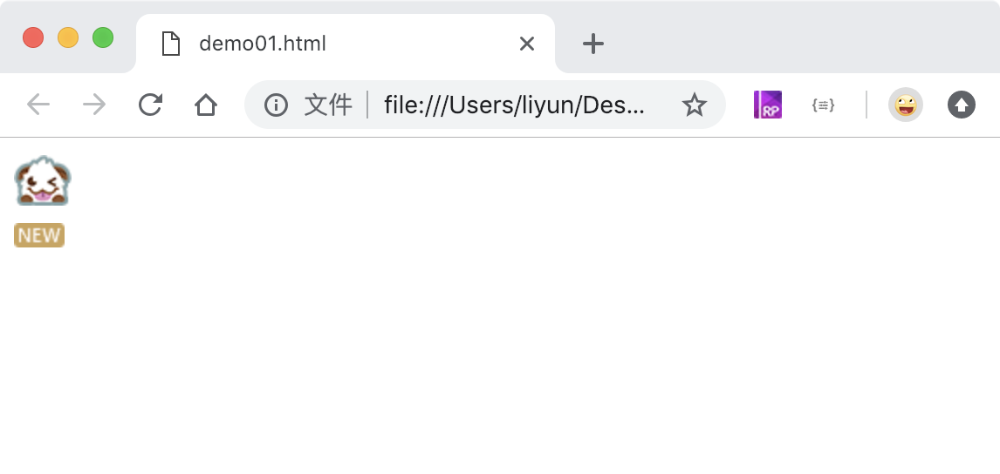

<!-- 2018-11-07 -->

# 雪碧图

> 雪碧图是从 `sprite` 单词音译过来的，表示将很多很多的小图标放到一张图片上，用来减少浏览器对服务器的请求。提升页面访问速度

方法：

-   控制元素的宽度和高度
-   控制 `background-position` 属性

## 案例

```html
<style>
    div {
        margin: 10px 0;
        background-image: url("./images/comm-spr.png");
    }

    div:nth-child(1) {
        width: 33px;
        height: 29px;
        background-position: -193px -12px;
    }

    div:nth-child(2) {
        width: 29px;
        height: 14px;
        background-position: -247px -46px;
    }
</style>
<div></div>
<div></div>
```

[案例源码](./demo/demo01.html)


