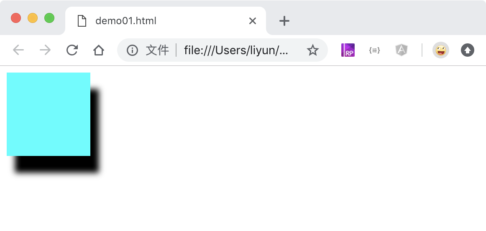

<!-- 2018-11-07 -->

# 给盒子添加阴影/投影

格式：box-shadow: X 轴偏移距离 Y 轴偏移距离 模糊距离 颜色；

```html
<style>
    div {
        width: 100px;
        height: 100px;
        background-color: aqua;
        box-shadow: 10px 20px 10px black;
    }
</style>
<div></div>
```

[](./demo/demo01.html)


