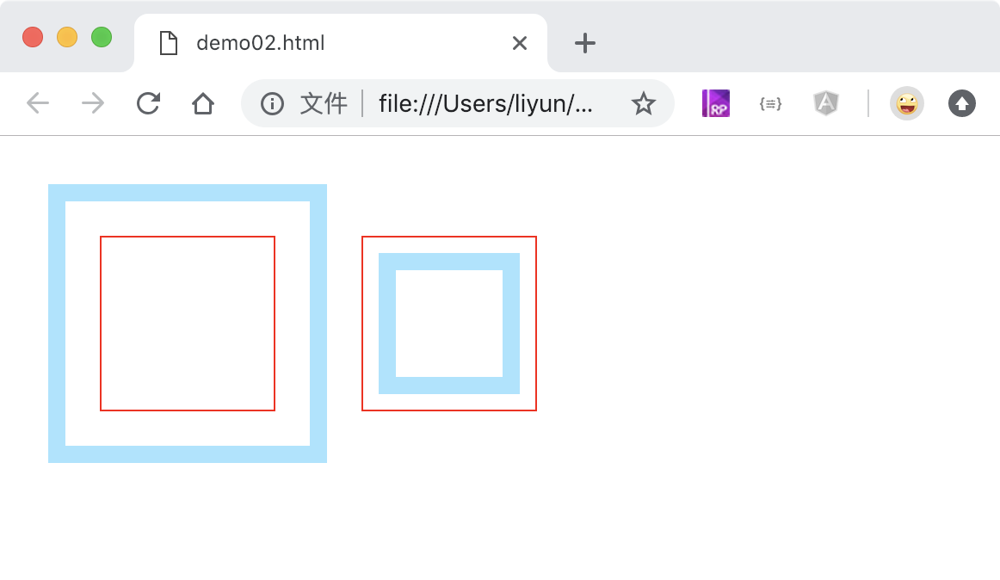

# 给元素添加一个外边框

格式：outline: 边框宽度 边框样式 边框颜色;

相当于以下三种属性：

-   outline-width: 边框宽度
-   outline-style：边框样式(等同于 border-style 的样式)
-   outline-color：边框颜色

```html
<style>
    div {
        width: 100px;
        height: 100px;
        outline: 10px solid rgba(0, 195, 255, 0.459);
    }
</style>
<div></div>
<div></div>
```

[案例源码](./demo/demo01.html)


PS:

> 上面案例中，中间的外边框实际上发生了重叠现象，上半部分属于第二个 div 的外边框，下半部分属于第一个 div 的外边框

## 给外边框设置一个偏移距离

格式：outline-offset: 偏移距离；

```html
<style>
    div {
        width: 100px;
        height: 100px;
        float: left;
        margin-top: 50px;
        margin-left: 50px;
        border: 1px solid red;
        outline: 10px solid rgba(0, 195, 255, 0.459);
    }
    div:nth-child(1) {
        outline-offset: 20px;
    }
    div:nth-child(2) {
        outline-offset: -20px;
    }
</style>
<div></div>
<div></div>
```

[案例源码](./demo/demo02.html)


