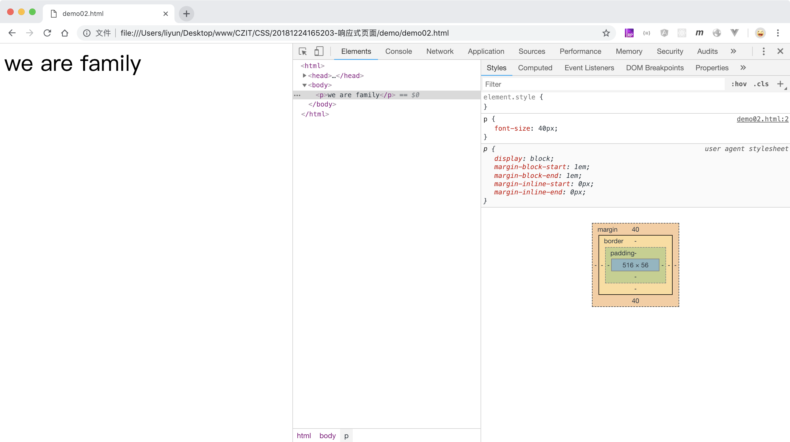

# 响应式 web 页面

电脑显示器的分辨率越来越高，一些访问量大的网站，就需要为使用不同分辨率显示器的用户，提供不同的页面样式。这是一项很大的工作。意味着要针对不同的尺寸的屏幕，写出多份样式文件。

<!-- 看一下之前LOL案例在手机上的展示效果 -->

2010 年 5 月“响应式网页设计”的理念被正式提出，大体内容如下：

> 页面的设计与开发应当根据用户行为以及设备环境(系统平台、屏幕尺寸、屏幕定向等)进行相应的响应和调整。具体的实践方式由多方面组成，包括弹性网格和布局、图片、CSS media query 的使用等。无论用户正在使用笔记本还是 iPad，我们的页面都应该能够自动切换分辨率、图片尺寸及相关脚本功能等，以适应不同设备；换句话说，页面应该有能力去自动响应用户的设备环境。响应式网页设计就是一个网站能够兼容多个终端——而不是为每个终端做一个特定的版本。这样，我们就可以不必为不断到来的新设备做专门的版本设计和开发了

响应式案例页面：

-   [https://www.metinfo.cn/case/]([https://www.metinfo.cn/case/)
-   [https://www.apple.com/cn/](https://www.apple.com/cn/)
-   [http://www.oppo.com/cn/](http://www.oppo.com/cn/)

CSS 为我们提供了“媒体查询”功能，使用格式如下：

```css
@media 条件 {
    /* 样式 */
}
```

`@media`用来告诉浏览器，只有满足我后面条件的时候，才能使用里面的样式。

## 根据媒体设备设置样式

`CSS2` 中的媒体查询功能，可以告诉我们当前正在访问页面的设备类型，便于针对不同的设备类型，应用不同的 CSS 样式

| 设备类型   | 说明                                                   |
| ---------- | ------------------------------------------------------ |
| all        | 用于所有的媒体设备。                                   |
| aural      | 用于语音和音频合成器。                                 |
| braille    | 用于盲人用点字法触觉回馈设备。                         |
| embossed   | 用于分页的盲人用点字法打印机。                         |
| handheld   | 用于小的手持的设备。                                   |
| print      | 用于打印机。                                           |
| projection | 用于方案展示，比如幻灯片。                             |
| screen     | 用于电脑显示器。                                       |
| tty        | 用于使用固定密度字母栅格的媒体，比如电传打字机和终端。 |
| tv         | 用于电视机类型的设备                                   |

先来看一个针对网页和打印机上使用不同样式的案例：

```html
<style>
    p {
        font-size: 40px;
    }
    @media screen {
        p {
            color: red;
        }
    }
    @media print {
        p {
            color: green;
        }
    }
</style>
<p>we are family</p>
```


在网页中显示的 p 元素，和在打印预览中的 P 元素，文字颜色很明显是不一样的

## 根据页面宽度设置样式

`CSS3`中对媒体查询功能，增加了查询“viewport(屏幕可视区域)的宽度、高度，设备的宽度、高度，屏幕方向(横屏还是竖屏), 分辨率”等功能，并且废弃了一些`CSS2`中的设备类型条件。

被废弃的类型以及新增的媒体查询条件可以[点击这里查看](http://www.runoob.com/cssref/css3-pr-mediaquery.html)

其中`min-width:1000px`用来设置当页面可视区域`大于等于` 1000 像素时的元素样式，`max-width:1000px`用来设置当页面可视区域`小于等于` 1000 像素时的元素样式

来看一个根据当前页面宽度引用不同样式的案例：

```html
<style>
    @media (max-width: 599px) {
        p {
            font-size: 40px;
        }
    }
    @media (min-width: 600px) {
        p {
            font-size: 80px;
        }
    }
</style>
<p>we are family</p>
```

下面是可视区域小于 600px 的效果:



下面是可视区域大于 600px 的效果:


实际页面开发中，可以先设置页面在最小屏幕中的样式，再逐步设置页面在更大屏幕中的样式；也可以倒过来。

从小到大设置的案例：

```html
<style>
    /* 通用样式 */
    @media (max-width: 767px) {
        /* 小屏中的样式 */
    }
    @media (min-width: 768px) {
        /* 中屏中的样式 */
    }
    @media (min-width: 1024px) {
        /* 大屏中的样式 */
    }
    @media (min-width: 1200px) {
        /* 超大屏中的样式 */
    }
</style>
```

从大到小设置的案例：

```html
<style>
    /* 通用样式 */
    @media (min-width: 1211px) {
        /* 超大屏中的样式 */
    }
    @media (max-width: 1200px) {
        /* 中屏中的样式 */
    }
    @media (max-width: 1024px) {
        /* 大屏中的样式 */
    }
    @media (max-width: 768px) {
        /* 小屏中的样式 */
    }
</style>
```

注意事项：

-   `通用样式`指的是不管页面可视区域有多宽都不会变化的样式
-   不管是从大到小，还是从小到大，第一种 CSS 规则都可以不写进 media 中，也就是说，可以当做默认的样式，像下面这样

```html
<style>
    /* 通用样式和小屏中的样式 */
    @media (min-width: 768px) {
        /* 中屏中的样式 */
    }
    @media (min-width: 1024px) {
        /* 大屏中的样式 */
    }
    @media (min-width: 1200px) {
        /* 超大屏中的样式 */
    }
</style>
```

## 根据设备屏幕方向设置样式

```html
<style>
    p {
        font-size: 80px;
    }
    @media (orientation: portrait) {
        p {
            color: red;
        }
    }
    @media (orientation: landscape) {
        p {
            color: green;
        }
    }
</style>
<p>we are family</p>
```

这是竖屏下的效果：


这是横屏下的效果：


## 组合媒体查询

CSS 支持同时使用多种媒体查询条件。

```html
<style>
    @media (min-width: 300px) and (max-width: 400px) {
        /* 只有当页面宽度大于等于300px且小于等于400px的时候，使用这里的样式 */
    }

    @media only screen {
        /* 只有当页面是在电脑、平板、手机屏幕中访问时，才使用这里的样式 */
    }

    @media all {
        /* 在所有访问设备中都使用这里的样式 */
    }
</style>
```
