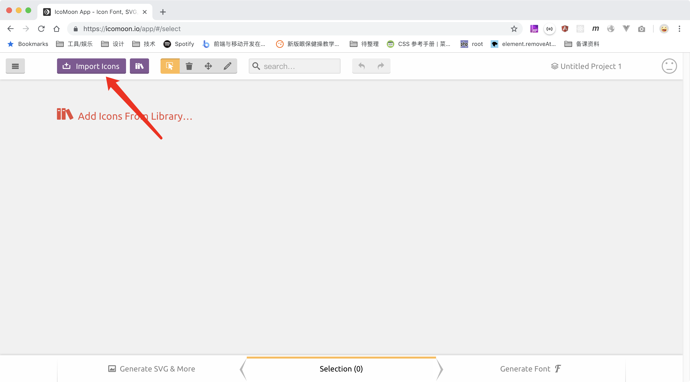
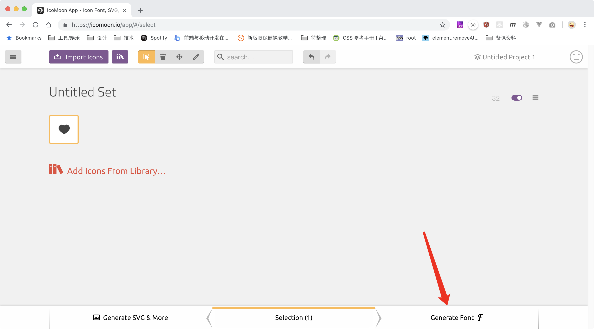
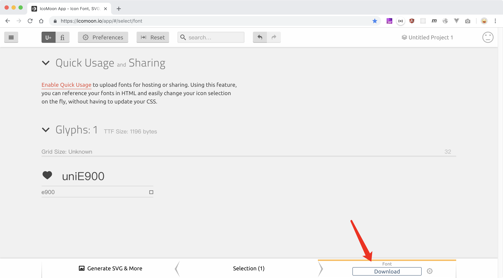

# 制作图标字体

## 生成字体文件

打开[图标字体制作网站](https://icomoon.io/app/#/select),点击`Import Icon`。导入准备好的 svg 文件



导入成功后，点击选中页面中刚才上传的 svg 图片


点击页面右下角的`Generator Font`按钮



当`Generator Font`按钮变成一个`download`按钮的时候，点击按钮即可下载字体的压缩包文件。



压缩包中有一个`fonts`文件夹，里面是生成的 4 种类型的字体文件


## 使用字体文件

生成的字体文件需要在`css`中引入

```css
@font-face {
    font-family: myFont;
    src: url("字体文件路径");
}
```

