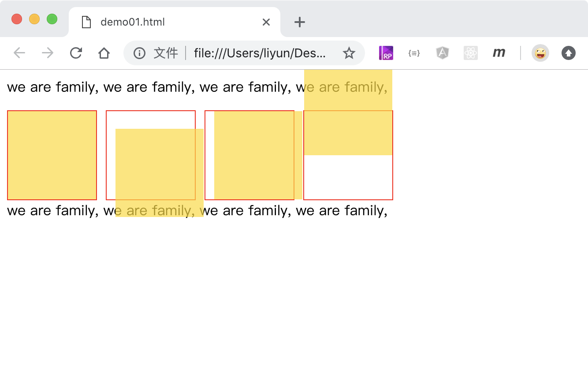

# CSS 中的 2D 效果

`transform`属性用来给元素添加 2D 效果。2D 效果包含以下几种：

| 属性值    | 效果         |
| --------- | ------------ |
| translate | 平移         |
| scale     | 缩放         |
| rotate    | 旋转         |
| skew      | 倾斜（变形） |

-   2D 效果不会影响元素在页面中的显示位置
-   2D 效果会遮挡住其他元素

## 平移

格式： `transform: translate(X 轴距离, Y 轴距离)`

也可以分开设置 X 轴和 Y 轴方向的平移距离

-   transform: translateX()
-   transform: translateY()

当平移距离使用百分比的时候，以元素本身的宽高作为参照物。

[点击查看完整案例](./demo/demo01.html)

```html
<style>
    .outer {
        width: 100px;
        height: 100px;
        border: 1px solid red;
        float: left;
        margin-right: 10px;
    }
    .inner {
        width: 100px;
        height: 100px;
        background-color: rgba(255, 217, 0, 0.692);
        transform: translate(0, 0);
    }
    .outer:nth-of-type(2) .inner {
        transform: translate(10px, 20px);
    }
    .outer:nth-of-type(3) .inner {
        transform: translateX(10px);
    }
    .outer:nth-of-type(4) .inner {
        transform: translateY(-50px);
    }
    p {
        clear: both;
    }
</style>
<p>we are family, we are family, we are family, we are family,</p>
<div class="outer"><div class="inner"></div></div>
<div class="outer"><div class="inner"></div></div>
<div class="outer"><div class="inner"></div></div>
<div class="outer"><div class="inner"></div></div>
<p>we are family, we are family, we are family, we are family,</p>
```


