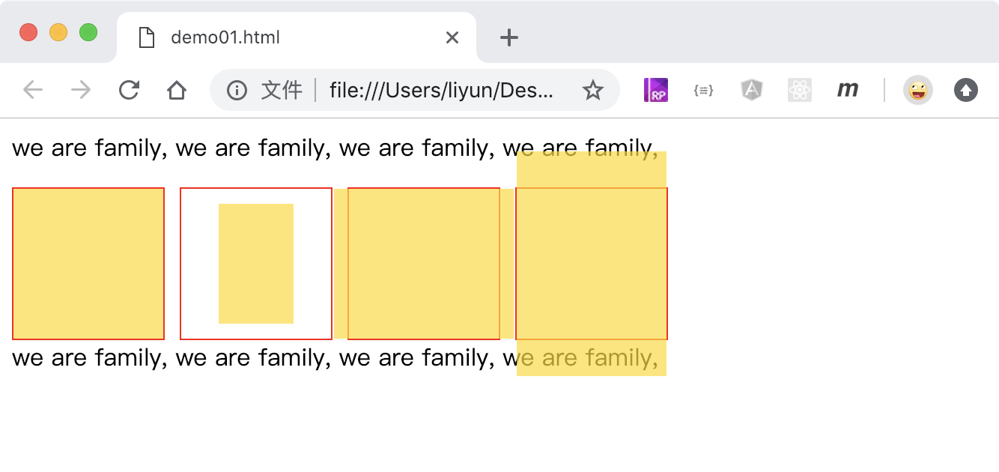

# 2D 效果 缩放

格式： `transform: scale(X 轴缩放倍数, Y 轴缩放倍数)`

-   倍数小于 1，表示缩小元素
-   倍数大于 1，表示放大元素
-   倍数不能小于等于 0
-   如果小于等于 0，元素就看不到了

也可以分开设置 X 轴和 Y 轴方向的缩放倍数

-   transform: scaleX()
-   transform: scaleY()

```html
<style>
    .outer {
        width: 100px;
        height: 100px;
        border: 1px solid red;
        float: left;
        margin-right: 10px;
    }
    .inner {
        width: 100px;
        height: 100px;
        background-color: rgba(255, 217, 0, 0.692);
        transform: scale(1, 1);
    }
    .outer:nth-of-type(2) .inner {
        transform: scale(0.5, 0.8);
    }
    .outer:nth-of-type(3) .inner {
        transform: scaleX(1.2);
    }
    .outer:nth-of-type(4) .inner {
        transform: scaleY(1.5);
    }
    p {
        clear: both;
    }
</style>
<p>we are family, we are family, we are family, we are family,</p>
<div class="outer"><div class="inner"></div></div>
<div class="outer"><div class="inner"></div></div>
<div class="outer"><div class="inner"></div></div>
<div class="outer"><div class="inner"></div></div>
<p>we are family, we are family, we are family, we are family,</p>
```

[点击查看完整案例](./demo/demo01.html)


