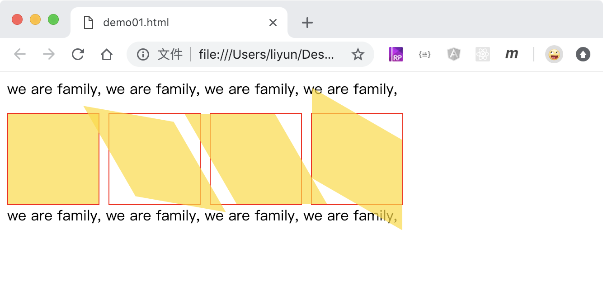

# 倾斜

格式： transform: skew(X 轴倾斜度数， Y 轴 倾斜度数)

也可以分开设置 X 轴和 Y 轴方向的倾斜度数

-   transform: skewX()
-   transform: skewY()

```html
<style>
    .outer {
        width: 100px;
        height: 100px;
        border: 1px solid red;
        float: left;
        margin-right: 10px;
    }
    .inner {
        width: 100px;
        height: 100px;
        background-color: rgba(255, 217, 0, 0.692);
        transform: skew(0deg, 0deg);
    }
    .outer:nth-of-type(2) .inner {
        transform: skew(30deg, 30deg);
    }
    .outer:nth-of-type(3) .inner {
        transform: skewX(30deg);
    }
    .outer:nth-of-type(4) .inner {
        transform: skewY(30deg);
    }
    p {
        clear: both;
    }
</style>
<p>we are family, we are family, we are family, we are family,</p>
<div class="outer"><div class="inner"></div></div>
<div class="outer"><div class="inner"></div></div>
<div class="outer"><div class="inner"></div></div>
<div class="outer"><div class="inner"></div></div>
<p>we are family, we are family, we are family, we are family,</p>
```

[点击查看完整案例](./demo/demo01.html)


