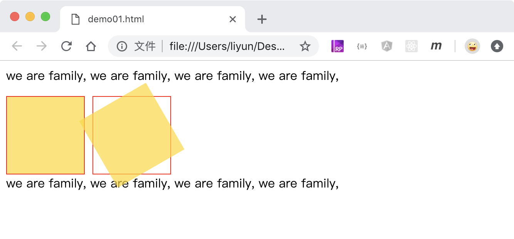

# 旋转

格式： transform: rotate(旋转度数)

-   旋转度数大于 0 的时候，元素按照顺时针方向旋转
-   旋转度数小于 0 的时候，元素按照逆时针旋转

```html
<style>
    .outer {
        width: 100px;
        height: 100px;
        border: 1px solid red;
        float: left;
        margin-right: 10px;
    }
    .inner {
        width: 100px;
        height: 110px;
        background-color: rgba(255, 217, 0, 0.699);
        transform: rotate(0);
    }
    .outer:nth-of-type(2) .inner {
        width: 100px;
        height: 110px;
        background-color: rgba(255, 217, 0, 0.699);
        transform: rotate(30deg);
    }

    p {
        clear: both;
    }
</style>
<p>we are family, we are family, we are family, we are family,</p>
<div class="outer"><div class="inner"></div></div>
<div class="outer"><div class="inner"></div></div>
<p>we are family, we are family, we are family, we are family,</p>
```

[点击查看完整案例](./demo/demo01.html)


