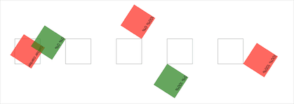
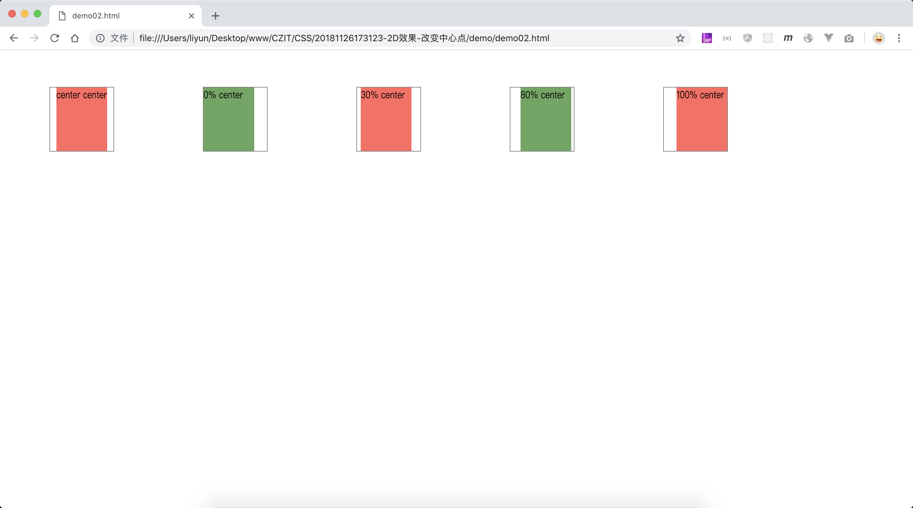
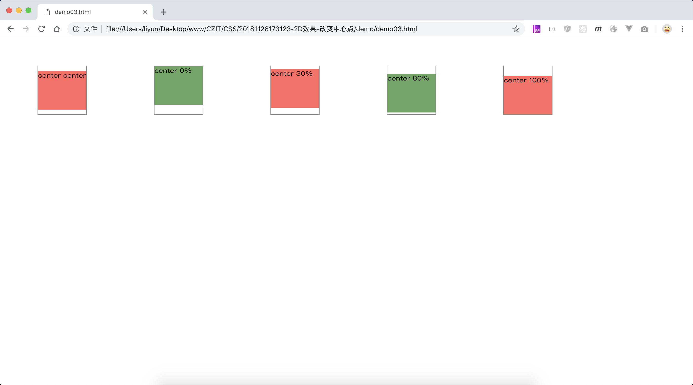

# 改变 2D 变换的中心点

添加`transform-origin: X轴位置 Y轴位置`属性用来改变 2D 变换的中心点。

-   X 轴上：0%(`left`)对应着元素的最左边，100%(`right`)对应着元素的最右边
-   Y 轴上：0%(`top`)对应着元素的最上边，100%(`bottom`)对应着元素的最下边
-   默认值是`50% 50%`或者是`center center`
-   百分比值可以使用对应的英文单词代替
-   百分比是相对于使用了`transform`属性的元素本身去计算的
-   这个属性只会影响旋转和缩放效果

## 改变旋转的中心点

```html
<style>
    .outer {
        width: 100px;
        height: 100px;
        float: left;
        margin: 150px 50px;
        border: 1px solid gray;
    }
    .inner {
        width: 100%;
        height: 100px;
        animation: rotate 3s linear;
        animation-iteration-count: infinite;
    }
    .outer:nth-child(odd) .inner {
        background-color: rgba(255, 0, 0, 0.692);
    }
    .outer:nth-child(even) .inner {
        background-color: rgba(0, 128, 0, 0.692);
    }
    .outer:nth-child(1) .inner {
        transform-origin: center center;
    }
    .outer:nth-child(2) .inner {
        transform-origin: 0% 0%;
    }
    .outer:nth-child(3) .inner {
        transform-origin: 100% 0%;
    }
    .outer:nth-child(4) .inner {
        transform-origin: 0% 100%;
    }
    .outer:nth-child(5) .inner {
        transform-origin: 100% 100%;
    }
    @keyframes rotate {
        0% {
            transform: rotate(0deg);
        }
        100% {
            transform: rotate(360deg);
        }
    }
</style>
<div class="outer"><div class="inner">center center</div></div>
<div class="outer"><div class="inner">0% 0%</div></div>
<div class="outer"><div class="inner">100% 0%</div></div>
<div class="outer"><div class="inner">0% 100%</div></div>
<div class="outer"><div class="inner">100% 100%</div></div>
```

[案例代码](./demo/demo01.html)



## X 轴上的缩放中心点

```html
<style>
    .outer {
        width: 100px;
        height: 100px;
        float: left;
        margin: 50px 70px;
        border: 1px solid gray;
    }
    .inner {
        width: 100%;
        height: 100px;
        transform: scaleX(0.8);
    }
    .outer:nth-child(odd) .inner {
        background-color: rgba(255, 0, 0, 0.692);
    }
    .outer:nth-child(even) .inner {
        background-color: rgba(0, 128, 0, 0.692);
    }
    .outer:nth-child(1) .inner {
        transform-origin: center center;
    }
    .outer:nth-child(2) .inner {
        transform-origin: 0% center;
    }
    .outer:nth-child(3) .inner {
        transform-origin: 30% center;
    }
    .outer:nth-child(4) .inner {
        transform-origin: 80% center;
    }
    .outer:nth-child(5) .inner {
        transform-origin: 100% center;
    }
</style>
<div class="outer"><div class="inner">center center</div></div>
<div class="outer"><div class="inner">0% center</div></div>
<div class="outer"><div class="inner">30% center</div></div>
<div class="outer"><div class="inner">80% center</div></div>
<div class="outer"><div class="inner">100% center</div></div>
```

[案例代码](./demo/demo02.html)



`X轴`中上的缩放，只与`X轴位置`有关，`X轴位置`不同，元素缩放的效果也各不相同

## Y 轴上的缩放

```html
<style>
    .outer {
        width: 100px;
        height: 100px;
        float: left;
        margin: 50px 70px;
        border: 1px solid gray;
    }
    .inner {
        width: 100%;
        height: 100px;
        transform: scaleY(0.8);
    }
    .outer:nth-child(odd) .inner {
        background-color: rgba(255, 0, 0, 0.692);
    }
    .outer:nth-child(even) .inner {
        background-color: rgba(0, 128, 0, 0.692);
    }
    .outer:nth-child(1) .inner {
        transform-origin: center center;
    }
    .outer:nth-child(2) .inner {
        transform-origin: center 0%;
    }
    .outer:nth-child(3) .inner {
        transform-origin: center 30%;
    }
    .outer:nth-child(4) .inner {
        transform-origin: center 80%;
    }
    .outer:nth-child(5) .inner {
        transform-origin: center 100%;
    }
</style>
<div class="outer"><div class="inner">center center</div></div>
<div class="outer"><div class="inner">center 0%</div></div>
<div class="outer"><div class="inner">center 30%</div></div>
<div class="outer"><div class="inner">center 80%</div></div>
<div class="outer"><div class="inner">center 100%</div></div>
```

[案例代码](./demo/demo03.html)



`Y轴`中上的缩放，只与`Y轴位置`有关，`Y轴位置`不同，元素缩放的效果也各不相同
